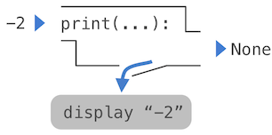

# 1.2 编程元素

> 来源：[1.2   The Elements of Programming](http://www.composingprograms.com/pages/12-elements-of-programming.html)


编程语言是操作计算机来执行任务的手段，编程语言还作为一个框架，我们可以在其中组织我们关于计算过程的想法。编程社群的成员之间通过程序交流想法。所以，程序必须为人类阅读而编写，并且仅仅碰巧可以让机器执行。

当我们描述一种语言时，我们应该特别注意该语言提供的将简单的思想组合成更复杂的思想的手段。 每一种强大的语言都有三种这样的机制：

- 基本表达式和语句：代表语言提供的最简单的构建块。

+ 组合的方式：通过组合，我们可以用简单的元素构建出来复杂的元素
+ 抽象的方法：通过这种方法可以将复合元素命名为单元并对其进行操作

在编程中，我们处理两种元素：函数和数据。（很快我们就会发现它们实际上并没有那么明显。）不正式地说，数据是我们想要操作的东西，函数描述了操作数据的规则。所以，任何强大的编程语言都应该能描述基本数据和基本函数，并且应该拥有组合和抽象二者的方式。


## 1.2.1 表达式

在上一节中对完整的 Python 解释器进行了试验后，我们现在重新开始，按照顺序一步步地探索 Python 语言。如果示例看上去很简单，要有耐心 -- 更刺激的东西还在后面。

我们以基本表达式作为开始。一种基本表达式就是数值。

```python
>>> 42
42
```

表示数值的 基本表达式 和 算术运算符 组合形成 复合表达式 ，解释器会计算它：

```python
>>> -1 - -1
0
>>> 1/2 + 1/4 + 1/8 + 1/16 + 1/32 + 1/64 + 1/128
0.9921875
```

这些算术表达式使用了运算符（例如`+`、`-`、`*`、`/`），这些运算符出现在值(这里指数值)中间。Python有许多方法来形成复合表达式。我们不会尝试立即将它们列举出来，而是慢慢的介绍新的表达式和它们支持的语言特性。


## 1.2.2 函数调用

最重要的复合表达式之一是**函数调用**，我们用一些参数来调用函数。在代数中，函数的概念是一些输入值到输出值的映射。例如，`max`函数将其输入映射到单个输出，输出是输入中的最大值。Python 中的函数不仅仅是输入输出的映射，它还表述了计算过程。但是，Python 表示函数的方式和数学中相同。

**函数**调用：函数名在圆括号之前，圆括号包含逗号分隔的参数。参数可以是任何值。

在这个例子中，我们用参数 7.5 和 9.5 调用`max`函数，并且返回 9.5。

```python
>>> max(7.5, 9.5)  #一个函数调用
9.5
```

当计算函数调用时，函数调用中的参数的顺序极其重要。例如，`pow(a,b)`计算a的b次方。

```python
>>> pow(100, 2)
10000
>>> pow(2, 100)
1267650600228229401496703205376
```

与使用运算符相比，函数具有三个主要优点。 首先，函数可以接受任意数量的参数：

```python
>>> max(1, -2, 3, -4)
3
```

不会产生歧义，因为函数的名称永远在参数前面。

其次，函数可以很容易的扩展为嵌套表达式：函数的参数是复合表达式(这是我们指函数调用)。嵌套结构在括号中是非常明确的。

```python
>>> max(min(1, -2), min(pow(3, 5), -4))
-2
```

（理论上）这种嵌套没有任何限制，并且 Python 解释器可以解释任何复杂的表达式。然而，人们可能会被多级嵌套搞晕。作为程序员的一个重要责任就是编写你自己、你的同伴以及其它在未来可能会阅读你代码的人可以解释的表达式。

最后，运算符在形式上多种多样：星号表示乘法，上标表示乘方，横杠表示除法etc。这些符号中一些非常难以打出来。虽然 Python 通过运算符（比如`+`和`-`）来支持常见的数学运算，但是任何运算符都可以用函数来代替。


## 1.2.3 导入库函数

Python 定义了大量的函数，包括上一节提到的运算符函数，但默认情况下并没有提供它们的所有名称。相反，它将这些已知的函数和其它东西组织在模块中，这些模块组成了 Python 库。需要导入这些模块来使用这些元素。例如，`math`模块提供了大量的常用数学函数：

```python
>>> from math import sqrt, exp
>>> sqrt(256)
16.0
```

`operator`模块提供了运算符对应的函数：

```python
>>> from operator import add, sub, mul
>>> add(14, 28)
42
>>> sub(100, mul(7, add(8, 4)))
16
```

`import`语句标明了模块名称（例如`operator`或`math`），之后列出要导入该模块的函数或者其他东西（例如`sqrt`）。一个函数一旦被导入，就可以被多次调用。

使用这些运算符函数（例如 add）和运算符（例如 +）没有区别。 通常，大多数程序员使用运算符来表达简单的算术

[Python 3 库文档](http://docs.python.org/py3k/library/index.html)列出了定义在每个模块中的函数，例如[main模块](http://docs.python.org/py3k/library/math.html)。但是，此文档是为熟悉整个语言的开发人员编写的。 现在，您可能会发现，与阅读文档相比，对函数进行试验可以告诉您更多有关其行为的信息。 随着您熟悉 Python ，本文档将成为宝贵的参考资源


## 1.2.4 名称和环境

编程语言的一个关键方面是它提供了使用名称来引用计算对象的方法。 如果一个值被赋予了一个名字，我们就说这个名字绑定到了这个值。

在 Python 中，我们可以使用赋值语句来建立新的绑定，它包含`=`左边的名称和右边的值。

```python
>>> radius = 10
>>> radius
10
>>> 2 * radius
20
```

名称也可以通过`import`语句绑定：

```python
>>> from math import pi
>>> pi * 71 / 223
1.0002380197528042
```

= 符号在 Python（和许多其他语言）中称为赋值运算符。 赋值是我们最简单的抽象方法，因为它允许我们使用简单的名称来引用复合运算的结果，例如上面对面积的计算。 通过这种方式，通过逐步构建复杂度不断增加的计算对象来构建复杂的程序。

将名称绑定到值然后通过名称检索这些值的可能性意味着解释器必须维护某种内存来跟踪名称、值和绑定。 这些内存称为环境。

名称也可以绑定到函数。 例如，名称 max 绑定到我们一直使用的 max 函数。 与数字不同，函数难以呈现为文本，因此当被要求描述函数时，Python 会打印识别描述：

```python
>>> max
<built-in function max>
```

我们可以使用赋值运算符来给现有函数起新的名字：

```python
>>> f = max
>>> f
<built-in function max>
>>> f(3, 4)
4
```

正确的赋值语句可以将名称绑定到新的值：

```python
>>> f = 2
>>> f
2
```

在 Python 中，通过赋值绑定的名称通常叫做变量名称，因为它们在执行程序期间可以绑定到许多不同的值上面。当名称通过赋值绑定到新值时，它不再绑定到任何以前的值。 甚至可以将内置名称绑定到新值。

```python
>>> max = 5
>>> max
5
```

将 max 分配给 5 后，名称 max 不再绑定到max函数，因此尝试调用 max(2, 3, 4) 将导致错误。

执行赋值语句时，Python 会先计算 = 右侧的表达式，然后再将它的值绑定到左侧的名称上。 因此，可以在右侧表达式中引用一个名称，即使它是要由赋值语句绑定的名称。

```python
>>> x = 2
>>> x = x + 1
>>> x
3
```

我们也可以在一个语句中将多个值绑定到多个名称上，其中名称和表达式由逗号分隔：

```python
>>> area, circumference = pi * radius * radius, 2 * pi * radius
>>> area
314.1592653589793
>>> circumference
62.83185307179586
```

更改一个名称的值不会影响其他名称。 即修改`radius`的值不会影响`area`的值，尽管`area`的值是由定义`radius`时的值构成的。修改`area`的值需要另一个赋值语句

```python
>>> radius = 11 #修改值
>>> area
314.1592653589793
>>> area = pi * radius * radius
380.132711084365
```

使用多重赋值时，= 右侧的所有表达式都会在左侧的任何名称绑定到这些值之前进行计算。 由于此规则，可以在单个语句中交换两个名称的值。

```python
>>> x, y = 3, 4.5
>>> y, x = x, y
>>> x
4.5
>>> y
3
```


## 1.2.5 嵌套函数调用的计算

本章的目标之一是隔离关于程序性思考的问题(to isolate issues about thinking procedurally)。举个例子，计算嵌套表达式时，解释器自己会遵循一个过程：

要计算调用表达式，Python 会执行下列事情：

+ 计算调用函数所用的参数，然后
+ 再用这些参数的值调用函数

即使是这个简单的过程也说明了一般过程中的一些要点。第一步规定，为了完成对函数调用的计算，我们首先必须计算出调用函数所用的参数的值。这个过程本质上是递归的，也就是说，它会调用其自身作为步骤之一。

例如，计算

```python
>>> mul(add(2, mul(4, 6)), add(3, 5))
208
```

需要计算四次函数调用。如果我们将每个需要计算的函数调用抽离出来，然后可视化这一过程的层次结构：


这张图看起来像树。在计算机科学中，树从顶端向下生长。

- 叶子节点（也就是没有子节点的节点）表示函数名或基本表达式(数值)，由函数名或数值组成

- 枝干节点表示参数是一个函数调用，由函数调用及其值组成

观察这棵树，我们可以想象参数的值向上流动，从叶子节点开始，在更高的层上融合。

接下来，顺着这颗树的结构观察，这会将我们带到需要计算的地方，并不是调用表达式，而是基本表达式和函数名，我们需要规定下列事物来谨慎对待基本的东西：

+ 数值计算为它标明的数字，
+ 名称计算为当前环境中这个名称所绑定到的值

请注意环境在确定表达式中符号含义方面的重要作用。在 Python 中，谈论表达式的值是没有意义的，例如

```python
>>> add(x, 1)
```

没有指定任何有关环境的信息，这些信息将为名称 x（甚至名称 add）提供含义。 环境提供了进行计算所需的上下文，这在我们理解程序执行中起着重要作用

这个计算过程并不符合所有 Python 代码的计算，仅仅是函数调用、数字和名称。例如，它并不能处理赋值语句。

```python
>>> x = 3
```

的执行并不返回任何值，也没有任何计算，因为赋值的目的是将一个名称绑定到一个值上。语句被用来执行，它们不产生值，但是会改变一些东西。每种语句或表达式都有自己的执行或计算过程，我们会在涉及时逐步介绍。

注：当我们说“数字计算为数值”的时候，数字是指我们按键盘上的数字 。 数值是指Python解释器对数字计算的结果 （个人理解）


## 1.2.6 纯函数与非纯函数


- 纯函数：具有一些输入（参数）以及返回一些输出（调用结果）的函数
- 特性：调用它们时除了返回一个值之外没有其它效果
```python
>>> abs(-2)
2
```

可以描述为接受输入并产生输出的小型机器


- 非纯函数：除了返回一个值之外，调用非纯函数会产生副作用，这会改变解释器或计算机的某些状态
- 一个普遍的副作用就是在返回值之外生成额外的输出，

```python
>>> print(-2) 
-2
>>> print(1, 2, 3)
1 2 3
>>> print(print(1), print(2))
1
2
None None  #None(表示没有任何东西)
```

Python 交互式解释器并不会自动打印`None`值。这里，`print`打印了`None`，作为调用`print`的副作用。




如果你发现自己不能预料到这个输出，画出表达式树来弄清为什么这个函数调用会产生奇怪的输出。

要当心`print`！它的返回值为`None`，意味着它不应该在赋值语句中用作表达式：

```python
>>> two = print(2)
2
>>> print(two)
None
```

纯函数受到限制，它们不能随着时间的推移产生副作用或改变行为。施加这些限制会产生巨大的好处。
- 纯函数可以更可靠地组合成复合调用表达式。我们可以在上面的非纯函数示例中看到，简单的调用`print`时不会返回有用的结果
- 另一方面，我们已经看到`max`、`pow`和`sqrt`等函数 可以在嵌套表达式中有效使用。
- 纯函数往往更易于测试。相同的参数列表将得到相同的返回值，可以将其与预期的返回值进行比较
