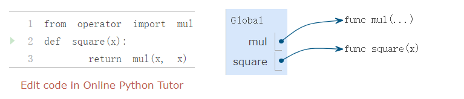

# 1.3 定义新的函数

> 来源：[1.3   Defining New Functions](http://www.composingprograms.com/pages/13-defining-new-functions.html)


我们已经在 Python 中认识了一些在任何强大的编程语言中都会出现的元素：

1.  数值是内置数据，运算符函数是内置函数。
2.  函数嵌套给程序提供了一种组合函数的手段。
3.  将名称绑定到值的方法提供了有限的抽象手段。

现在我们将要学习函数定义，一个更加强大的抽象技巧，名称通过它可以绑定到复合操作上，并可以作为一个单元来引用。

我们从表达“平方”这个概念来开始。在 Python 中我们可以这样表示：

```python
>>> def square(x):
        return mul(x, x)
```

它定义了一个名为 square 的函数，它用来计算`x`的平方。定义中的`x`叫做形参，它为要被乘的数提供一个名称。这个定义创建了这个用户定义的函数，并且将这个函数绑定到名称`square`上。

**函数定义**：函数定义由一个 `def` 语句组成，它标明了一个`<name>`（名称）和一个以逗号分隔的命名`<formal parameters>`列表（形式参数）。然后是一个称为函数体的 return 语句，它指定函数的 <return expression>，它是函数无论什么时候调用都需要计算的表达式。

```python
def <name>(<formal parameters>):
    return <return expression>
```

第二行必须缩进！我们缩进四个空格，return表达式并不会立即计算，只在调用函数时会被计算。

定义了`square`之后，我们用一个参数来调用它：

```python
>>> square(21)
441
>>> square(add(2, 5))
49
>>> square(square(3))
81
```

我们也可以定义其他函数时使用 `square` 函数，例如，我们定义`sum_squares`函数，它接受两个数值作为参数，并返回它们的平方和：

```python
>>> def sum_squares(x, y):
        return add(square(x), square(y))
>>> sum_squares(3, 4)
25
```

我们不可能在`sum_squares`的定义中分辨出`square`是否内置于解释器中，从模块导入还是由用户定义。

`def` 语句和赋值语句都将名称绑定到值，并且任何现有的绑定都将丢失。 例如，下面的 g 首先指代一个没有参数的函数，然后是一个数字，然后是一个有两个参数的不同函数。

```python
>>> def g():
        return 1
>>> g()
1
>>> g = 2
>>> g
2
>>> def g(h, i):
        return h + i
>>> g(1, 2)
3
```


## 1.3.1 环境

我们的 Python 子集已经足够复杂了，但程序的含义还不是非常明显。如果形式参数和内置函数具有相同名称会如何呢？两个函数是否能共享名称而不会产生混乱呢？为了解决这些疑问，我们必须详细描述环境。

计算表达式所在的**环境由一系列帧组成**。每一帧都包含了一些绑定，每个绑定都将一个名称与其对应的值相关联。 全局帧只有一个，赋值和导入语句将这些条目（entries）添加到当前环境的第一帧。 到目前为止，我们的环境仅由全局帧组成


此环境图显示了当前环境的绑定以及名称绑定到的值。 本文中的环境图是交互式的：您可以逐步浏览左侧小程序的线条，以查看右侧的环境状态演变。 您可以在网站 Online Python Tutor  中编辑代码以获的交互式的环境图，这是由 Philip Guo 创建的用于生成这些环境图的工具。 我们鼓励您自己创建示例并研究生成的环境图。

> 这里及以后都用静态图，Online Python Tutor的网址是https://pythontutor.com/composingprograms.html#mode=edit



每个函数都是以 func 开头，后面跟着函数名和形参的一行。 像 mul 之类没有形参的内置函数，它们的型参总是使用 ... 来代替。

函数名重复两次，一次在帧中，另一次作为函数本身的一部分。 出现在函数中的名称称为内置名称。 帧中的名称是绑定名称。 两者之间有一个区别：不同的名称可能指代同一个函数，但该函数本身只有一个内置名称。

绑定到帧中的函数的名称是在计算期间使用的名称。 函数的内在名称在计算中不起作用。 在Online Python Tutor网站上使用“前进”按钮逐步执行下面的示例，可以看到一旦名称 max 绑定到值 3，就不能再将其用作函数。


错误消息 `TypeError: 'int' object is not callable` 报告名称 max（当前绑定到数字 3）是一个整数而不是一个函数。 因此，它不能用作调用表达式中的运算符。

**函数签名**:函数的不同之处在于调用它们所使用的参数数量。  用户自定义函数`square`只取x； 提供更多或更少的参数将导致错误。 对一个函数的形参的描述称为函数签名

函数 `max` 可以接受任意数量的参数， 因此它呈现为 `max(...)`。 无论采用多少参数，所有内置函数都将呈现为 <name>(...)，因为这些原始函数从未明确定义。


## 1.3.2 函数调用

**每次调用函数的行为都会引入一个新的局部帧，它只能由该函数来访问。通过使用实参来调用函数：**

1.  在新的局部帧中，将实参绑定到函数的形参上
2.  在以此帧开始的环境中执行函数体

为了详细说明示例，下面描述了同一示例的环境图的几个步骤。 执行第一条import语句后，全局框架中只绑定了名字mul。

首先，执行函数square的定义语句。 请注意，整个 def 语句是在一个步骤中处理的。 函数体直到函数被调用（而不是在定义时）才会执行。

接下来，使用参数 -2 调用 square 函数，因此使用形参 x 绑定到值 -2并 创建一个局部帧。

然后，在当前环境中查找名称 x，如图所示该环境由两个帧组成。在这两次出现中，x 的计算结果为 -2，因此 square 函数返回 4

square帧中的“return value”不是名称绑定；相反，它表示调用创建该帧的函数时返回的值。


即使在这个简单的示例中，也使用了两种不同的帧。表达式 square(-2) 在全局帧中计算，调用函数square 创建了一个局部帧，而返回表达式 mul(x, x) 在该局部帧中计算。 x 和 mul 在不同的帧中绑定到这个环境中，

环境中帧的顺序会影响由表达式中的名称检索返回的值。我们之前说过，名称被计算为当前环境中与该名称关联的值。我们现在可以更精确一些：

**名称计算**: 一个名称被计算为当前环境中，最先发现该名称的帧中，绑定到这个名称的值

我们的环境、名称和函数的概念帧构成了一个计算模型； 虽然一些机械细节仍未明确（例如，如何实现绑定），但我们的模型确实准确且正确地描述了解释器如何计算函数调用。 在第 3 章中，我们将看到该模型如何作为一个蓝图来实现一个编程语言的工作解释器。


## 1.3.3 示例：函数调用

让我们再次考虑两个简单的函数定义并说明计算函数调用的过程


Python 首先计算名称`sum_squares`，该名称绑定到全局帧中的函数`sum_squares`。 原始数字表达式 5 和 12 的计算结果为它们所代表的数字。

之后，Python 调用了`sum_squares`，它创建了一个局部帧，在这个局部帧中将`x`绑定为 5，将`y`绑定为 12。

`sum_square`的函数体包含下列函数调用：

```python
   add     (  square(x)  ,  square(y)  )
 ________     _________     _________
"operator"   "operand 0"   "operand 1"
```

我们从标有`sum_squares`的帧开始。运算符`add`是全局帧中发现的名称，绑定到了内置的`add`函数上。两个参数必须在加法函数调用之前依次求值。两个参数都在当前环境中从标有` sum_squares` 的帧开始计算。

在参数 0 中，`square` 是在全局框架中定义的函数，而 x 在局部框架中绑定数字 5。 Python 通过使用5来调用`square`创建一个局部框架来将 x 与5绑定  

在使用这个局部帧的情况下，函数体表达式`mul(x, x)`求值为 25。

现在我们的求值过程轮到了参数 1，`y`的值为 12。Python 再次执行`square`的函数体。这次引入了另一个局部帧，将`x`与12绑定为。所以，操作数 1 计算结果是144。

最后，用实参 25 和 144 调用函数`add`会得到`sum_squares`函数体的最终值：169。

这张图虽然复杂，但是用于展示我们目前为止发展出的许多基本思想。名称绑定到值，这些值分布在许多不同的局部帧中，以及包含共享名称的单个全局框架。

所有这些机制的存在确保了名称在程序执行期间的正确时间解析为正确的值。这个例子展示了为什么我们的模型需要引入我们介绍的复杂性。所有三个局部帧都包含名称`x`的绑定。但是这个名称在不同的帧中绑定到了不同的值上。局部帧分离了这些名称。

## 1.3.4 局部名称

函数实现的细节之一是实现者对形式参数名称的选择不应影响函数的行为。所以，下面的函数应具有相同的行为：

```python
>>> def square(x):
        return mul(x, x)
>>> def square(y):
        return mul(y, y)
```

这个原则 -- 也就是函数应不依赖于编写者选择的参数名称 -- 对编程语言来说具有重要的影响。最简单的影响就是函数参数名称应保留在函数体的局部范围中。

如果参数不位于相应函数的局部范围中，`square`的参数`x`可能和`sum_squares`中的参数`x`产生混乱。严格来说，这并不是问题所在：不同局部帧中的`x`的绑定是不相关的。我们的计算模型经过精心设计以确保这种独立性。

我们说局部名称的作用域被限制在定义它的函数的函数体中。当一个名称离开了作用域，它就不能再被访问时。作用域的行为并不是我们模型的新事实，它是环境的工作方式的结果。

## 1.3.5 实践指南：选择名称

可修改的名称并不代表形式参数的名称完全不重要。反之，选择良好的函数和参数名称对于理解函数的作用至关重要。

下面的准则派生于 [Python 的代码风格指南](http://www.python.org/dev/peps/pep-0008)，可被所有（非反叛）Python 程序员作为指南。一些共享的约定会使社区成员之间的沟通变得容易。遵循这些约定有一些副作用，你会发现你的代码在内部变得更加一致。

1.  函数名称应该小写，以下划线分隔。提倡描述性的名称。
2.  函数名称通常反映解释器向参数应用的操作（例如`print`、`add`、`square`），或者结果（例如`max`、`abs`、`sum`）。
3.  参数名称应小写，以下划线分隔。提倡单个词的名称。
4.  参数名称应该反映参数在函数中的作用，并不仅仅是满足的值的类型。
5.  当作用非常明确时，单个字母的参数名称可以接受，但是永远不要使用`l`（小写的`L`）和`O`（大写的`o`），或者`I`（大写的`i`）来避免和数字混淆。

周期性对你编写的程序复查这些准则，不用多久你的名称会变得十分 Python 化。

## 1.3.6 作为抽象的函数

虽然`sum_squares`十分简单，但是它演示了用户定义函数的最强大的特性。`sum_squares`函数根据`square`函数来定义，但是仅仅依赖于`square`定义的输入参数和输出值之间的关系。

我们可以编写`sum_squares`，而不用考虑如何计算一个数的平方。计算平方的细节被隐藏了，并可以在之后考虑。确实，在`sum_squares`看来，`square`并不是一个特定的函数，而是某个函数的抽象，也就是所谓的函数抽象。在这个层级的抽象中，任何能计算平方的函数都是等价的。

所以，仅仅考虑返回值的情况下，下面两个计算平方的函数是难以区分的。每个都接受一个数作为参数并且生成该数字的平方作为返回值。

```python
>>> def square(x):
        return mul(x, x)
>>> def square(x):
        return mul(x, x-1) + x
```

换句话说，函数定义应该能够隐藏细节。用户可能不能自己编写函数，但是可以从其它程序员那里获得它。用户不应该需要知道如何实现该函数。Python 库拥有这个特性。许多开发者使用在库函数，但是很少有人看过它们的实现。实际上，许多 Python 库的实现并不完全用 Python 编写，而是 C 语言。

**函数抽象的方面**：要掌握函数抽象的使用，考虑它的三个核心属性通常很有用。 函数的域是它可以采用的参数集。 函数的范围是它可以返回的值的集合。 函数的目的是计算输入和输出之间的关系（以及它可能产生的任何副作用）。 通过域、范围和目的来理解函数抽象对于在复杂程序中正确使用它们至关重要。

例如，我们用来实现 `sum_squares` 的任何函数`squares`都应该具有以下属性

- 域是任何单个实数。
- 范围是任何非负实数。
- 目的是输出输入值的平方。

这些属性没有指定函数是如何执行的； 这些细节被抽象掉了。

## 1.3.7 运算符

算术运算符（例如`+`和`-`）提供了我们的第一个组合方法示例。但是我们还需要为包含这些运算符的表达式定义计算过程。

每个带有运算符的 Python 表达式都有自己的计算过程，但是你通常可以认为他们是调用表达式的快捷方式。当你看到

```python
>>> 2 + 3
5
```

的时候，可以简单认为它是

```python
>>> add(2, 3)
5
```

的快捷方式。

中缀符号可以嵌套，就像函数调用那样。Python 在运算符优先级上采用了常规的数学规则，该规则规定如何解释具有多个运算符的复合表达式

```python
>>> 2 + 3 * 4 + 5
19
```

和计算下面的函数调用得到的结果相同

```python
>>> add(add(2, mul(3, 4)) , 5)
19
```

Python 允许括号将子表达式括起来，来覆盖通常的优先级规则：

```python
>>> (2 + 3) * (4 + 5)
45
```

和下面的表达式的求值结果相同

```python
>>> mul(add(2, 3), add(4, 5))
45
```

在除法方面，Python 提供了两个中缀运算符：`/`和 `//`。前者是正常的除法，因此即使能够整除，结果也是浮点数

```python
>>> 5  /  4 
1.25 
>>> 8  /  4 
2.0
```

运算符`//`：结果等于用`/`替换`//`得到的结果再向下取整

```python
>>> 5 // 4
1
>>> -5 // 4
-2
```

这两个运算符是 truediv 和 floordiv 函数的简写。

```python
>>> from operator import truediv, floordiv
>>> truediv(5, 4)
1.25
>>> floordiv(5, 4)
1
```

你应该在你的程序中自由使用这些运算符和括号。对于简单的算术运算，Python 在惯例上倾向于运算符而不是调用表达式。
