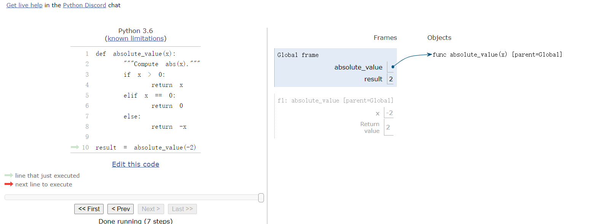
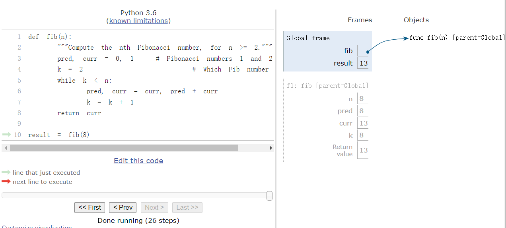

# 1.5 控制

> 来源：[1.5   Control](http://composingprograms.com/pages/15-control.html)

我们此时可以定义的函数的表达能力非常有限，因为我们还没有介绍一种用于比较的方法，该方法根据比较的结果来执行不同的操作。 控制语句将赋予我们这种能力。 它们是根据逻辑比较的结果来控制程序执行流程的语句。

语句与我们目前所研究的表达式有着根本的不同。 他们没有值。 执行控制语句不是计算某些东西，而是决定了解释器接下来应该做什么

## 1.5.1 语句

目前为止，我们主要是考虑了如何计算表达式。然而，我们已经看到了三种语句：赋值、`def`和`return`语句。这些 Python 代码本身并不是表达式，尽管它们都包含作为组件的表达式。

**语句不是用来计算的，而是用来执行的**
每个语句都描述了对解释器状态的一些改变，执行语句会应用这些改变。像我们之前看到的`return`和赋值语句那样，语句的执行可能会涉及到计算它包含的子表达式。

表达式也可以作为语句执行，这种情况下，Python会计算作为语句的表达式但舍弃计算该表达式得到的结果。执行纯函数没有什么副作用，但是执行非纯函数可能会对函数调用的结果产生影响。

考虑下面这个例子：

```python
>>> def square(x):
        mul(x, x) # Watch out! This call doesn't return a value.
```

这是有效的 Python 代码，但是并不是想表达的意思。函数体由表达式组成。表达式本身是个有效的语句，但是执行该语句的效果是：调用`mul`函数并舍弃其调用得到的结果。如果你希望对表达式的结果做一些事情，你需要这样做：使用赋值语句来储存它，或者使用`return`语句将它返回：

```python
>>> def square(x):
        return mul(x, x)
```

有时编写一个函数体是表达式的函数是有意义的，例如调用类似`print`的非纯函数：

```python
>>> def print_square(x):
        print(square(x))
```

在最高层级上，Python 解释器的工作就是执行由语句组成的程序。但是，许多有意思的计算工作来源于求解表达式。语句管理程序中不同表达式之间的关系，以及它们的结果会怎么样。

## 1.5.2 复合语句

通常，Python 代码是语句的序列。一条简单的语句是一行不以分号结束的代码。复合语句之所以这么命名，因为它是其它（简单或复合）语句的复合。复合语句一般占据多行，并且以一行以冒号结尾的头部开始，它标识了语句的类型。同时，一个头部和一组缩进的代码叫做子句（或从句）。复合语句由一个或多个子句组成。

```python
<header>:
    <statement>
    <statement>
    ...
<separating header>:
    <statement>
    <statement>
    ...
...
```

我们可以这样理解我们已经见到的语句：

+ 表达式、返回语句和赋值语句都是简单语句。
+ `def`语句是复合语句。`def`头部之后的组定义了函数体。

每种头部的专门计算规则指导了组内的语句什么时候以及是否会被执行。我们说头部控制语句组。例如，在`def`语句的例子中，我们看到返回表达式并不会立即求值，而是存储起来供以后在最终调用定义的函数时使用。

我们现在也能理解多行的程序了。

+ 执行语句序列需要执行第一条语句。如果这个语句不是重定向控制，之后执行语句序列的剩余部分，如果存在的话。

这个定义揭示出递归定义“序列”的基本结构：一个序列可以划分为它的第一个元素和其余元素。语句序列的“剩余”部分也是一个语句序列。所以我们可以递归应用这个执行规则。这个序列作为递归数据结构的看法会在随后的章节中再次出现。

这一规则的重要结果就是语句顺序执行，但是随后的语句可能永远不会执行到，因为有重定向控制。

**实践指南：**在缩进代码组时，所有行必须以相同数量以及相同方式缩进（空格而不是Tab）。任何缩进的变动都会导致错误。

## 1.5.3 定义函数 II：局部赋值

最初，用户定义函数的函数体只由带有一个返回表达式的一个返回语句组成。实际上，函数可以定义为操作的序列，不仅仅是一条表达式。Python 复合语句的结构自然让我们将函数体的概念扩展为多个语句。

无论用户定义的函数何时被调用，定义中的子句序列在局部环境内执行。`return`语句会重定向控制：无论什么时候执行`return`语句，函数调用的流程都会中止，返回表达式的值会作为被调用函数的返回值。

于是，赋值语句现在可以出现在函数体中。例如，这个函数以第一个数的百分数形式，返回两个数量的绝对值，并使用了两步运算：

```python
>>> def percent_difference(x, y):
        difference = abs(x-y)
        return 100 * difference / x
>>> percent_difference(40, 50)
25.0
```


赋值语句的效果是在当前环境的第一个帧上，将名字绑定到值上。于是，函数体内的赋值语句不会影响全局帧。函数只能操作局部作用域的现象是创建模块化程序的关键，其中纯函数只通过它们接受和返回的值与外界交互。

当然，`percent_difference`函数也可以写成一个表达式，就像下面这样，但是返回表达式会更加复杂：

```python
>>> def percent_difference(x, y):
        return 100 * abs(x-y) / x
```

目前为止，局部赋值并不会增加函数定义的表现力。当它和控制语句组合时，才会这样。此外，局部赋值也可以将名称赋为间接量，在理清复杂表达式的含义时起到关键作用。

## 1.5.4 条件语句

Python 拥有内建的绝对值函数：

```python
>>> abs(-2)
2
```

z我们希望自己能够实现这个函数，但是我们当前不能直接定义函数来执行测试并做出选择。我们希望表达出，如果`x`是正的，`abs(x)`返回`x`，如果`x`是 0，`abx(x)`返回 0，否则`abs(x)`返回`-x`。Python 中，我们可以使用条件语句来表达这种选择。

```python
>>> def absolute_value(x):
        """Compute abs(x)."""
        if x > 0:
            return x
        elif x == 0:
            return 0
        else:
            return -x
            
>>> absolute_value(-2) == abs(-2)
True
```



`absolute_value`的实现展示了一些重要的事情：

**条件语句。**Python 中的条件语句包含一系列的头部和语句组：一个必要的`if`子句，可选的`elif`子句序列，和最后可选的`else`子句：

```python
if <expression>:
    <suite>
elif <expression>:
    <suite>
else:
    <suite>
```

当执行条件语句时，每个子句都按顺序处理：

1.  求出头部中的表达式。
2.  如果它为真，执行语句组。之后，跳过条件语句中随后的所有子句。

如果能到达`else`子句（仅当所有`if`和`elif`表达式值为假时），它的语句组才会被执行。

**布尔上下文。**上面过程的执行提到了“假值”和“真值”。条件块头部语句中的表达式也叫作布尔上下文：它们值的真假对控制流很重要，但在另一方面，它们的值永远不会被赋值或返回。Python 包含了多种假值，包括 0、`None`和布尔值`False`。所有其他数值都是真值。在第二章中，我们就会看到每个 Python 中的原始数据类型都是真值或假值。

**布尔值。**Python 有两种布尔值，叫做`True`和`False`。布尔值表示了逻辑表达式中的真值。内建的比较运算符，`>`、`<`、`>=`、`<=`、`==`、`!=`，返回这些值。

```python
>>> 4 < 2
False
>>> 5 >= 5
True
```

第二个例子读作“5 大于等于 5”，对应`operator`模块中的函数`ge`。

```python
>>> 0 == -0
True
```

最后的例子读作“0 等于 -0”，对应`operator`模块的`eq`函数。要注意 Python 区分赋值（`=`）和相等测试（`==`）。许多语言中都有这个惯例。

**布尔运算符。**Python 也内建了三个基本的逻辑运算符：

```python
>>> True and False
False
>>> True or False
True
>>> not False
True
```

逻辑表达式拥有对应的求值过程。这些过程揭示了逻辑表达式的真值有时可以不执行全部子表达式而确定，这个特性叫做短路。

为了求出表达式`<left> and <right>`：

1.  求出子表达式`<left>`。
2.  如果结果`v`是假值，那么表达式求值为`v`。
3.  否则表达式的值为子表达式`<right>`。

为了求出表达式`<left> or <right>`：

1.  求出子表达式`<left>`。
2.  如果结果`v`是真值，那么表达式求值为`v`。
3.  否则表达式的值为子表达式`<right>`。

为了求出表达式`not <exp>`：

1.  求出`<exp>`，如果值是`True`那么返回值是假值，如果为`False`则反之。

这些值、规则和运算符向我们提供了一种组合测试结果的方式。执行测试以及返回布尔值的函数通常以`is`开头，并不带下划线（例如`isfinite`、`isdigit`、`isinstance`等等）。

## 1.5.5 迭代

除了选择要执行的语句，控制语句还用于表达重复操作。如果我们编写的每一行代码都只执行一次，程序会变得非常没有生产力。只有通过语句的重复执行，我们才可以释放计算机的潜力，使我们更加强大。我们已经看到了重复的一种形式：一个函数可以多次调用，虽然它只定义一次。迭代控制结构是另一种将相同语句执行多次的机制。

考虑斐波那契数列，其中每个数值都是前两个的和：

```python
0, 1, 1, 2, 3, 5, 8, 13, 21, ...
```

每个值都通过重复使用“前两个值的和”的规则构造。为了构造第 n 个值，我们需要跟踪我们创建了多少个值（`k`），以及第 k 个值（`curr`）和它的上一个值（`pred`），像这样：

```python
>>> def fib(n):
        """Compute the nth Fibonacci number, for n >= 2."""
        pred, curr = 0, 1   # Fibonacci numbers
        k = 2               # Position of curr in the sequence
        while k < n:
            pred, curr = curr, pred + curr  # Re-bind pred and curr
            k = k + 1                       # Re-bind k
        return curr
>>> fib(8)
13
```



要记住逗号在赋值语句中分隔了多个名称和值。这一行：

```python
pred, curr = curr, pred + curr
```

具有将`curr`的值重新绑定到名称`pred`上，以及将`pred + curr`的值重新绑定到`curr`上的效果。所有`=`右边的表达式会在绑定发生之前求出来。

`while`子句包含一个头部表达式，之后是语句组：

```python
while <expression>:
    <suite>
```

为了执行`while`子句：

1.  求出头部表达式。
2.  如果它为真，执行语句组，之后返回到步骤 1。

在步骤 2 中，整个`while`子句的语句组在头部表达式再次求值之前被执行。

为了防止`while`子句的语句组无限执行，它应该总是在每次通过时修改环境的状态。

不终止的`while`语句叫做无限循环。按下`<Control>-C`可以强制让 Python 停止循环。

## 1.5.6 实践指南：测试

函数的测试是验证函数的行为是否符合预期的操作。我们的函数现在已经足够复杂了，我们需要开始测试我们的实现。

测试是系统化执行这个验证的机制。测试通常写为另一个函数，这个函数包含一个或多个被测函数的样例调用。返回值之后会和预期结果进行比对。不像大多数通用的函数，测试涉及到挑选特殊的参数值，并使用它来验证调用。测试也可作为文档：它们展示了如何调用函数，以及什么参数值是合理的。

要注意我们也将“测试”这个词用于`if`或`while`语句的头部中作为一种技术术语。当我们将“测试”这个词用作表达式，或者用作一种验证机制时，它应该在语境中十分明显。

**断言。**程序员使用`assert`语句来验证预期，例如测试函数的输出。`assert`语句在布尔上下文中只有一个表达式，后面是带引号的一行文本（单引号或双引号都可以，但是要一致）如果表达式求值为假，它就会显示。

```python
>>> assert fib(8) == 13, 'The 8th Fibonacci number should be 13'
```

当被断言的表达式求值为真时，断言语句的执行没有任何效果。当它是假时，`asset`会造成执行中断。

为`fib`编写的`test`函数测试了几个参数，包含`n`的极限值：

```python
>>> def fib_test():
        assert fib(2) == 1, 'The 2nd Fibonacci number should be 1'
        assert fib(3) == 1, 'The 3nd Fibonacci number should be 1'
        assert fib(50) == 7778742049, 'Error at the 50th Fibonacci number'
```

在文件中而不是直接在解释器中编写 Python 时，测试可以写在同一个文件，或者后缀为`_test.py`的相邻文件中。

**Doctests**: Python 提供了一个便利的方法，将简单的测试直接写到函数的文档字符串内。文档字符串的第一行应该包含单行的函数描述，后面是一个空行。参数和行为的详细描述可以跟随在后面。此外，文档字符串可以包含调用该函数的简单交互式会话：

```python
>>> def sum_naturals(n):
        """Return the sum of the first n natural numbers

        >>> sum_naturals(10)
        55
        >>> sum_naturals(100)
        5050
        """
        total, k = 0, 1
        while k <= n:
          total, k = total + k, k + 1
        return total
```

之后，可以使用[doctest](http://docs.python.org/py3k/library/doctest.html)来验证交互。下面的`globals`函数返回全局变量的表示，解释器需要它来求解表达式。

```python
>>> from doctest import run_docstring_examples
>>> run_docstring_examples(sum_naturals, globals())
```

在文件中编写 Python 时，可以通过以下面的命令行选项启动 Python 来运行一个文档中的所有 `doctest`。

```python
python3 -m doctest <python_source_file>
```

高效测试的关键是在实现新的函数之后（甚至是之前）立即编写（以及执行）测试。只调用一个函数的测试叫做单元测试。详尽的单元测试是良好程序设计的标志。

