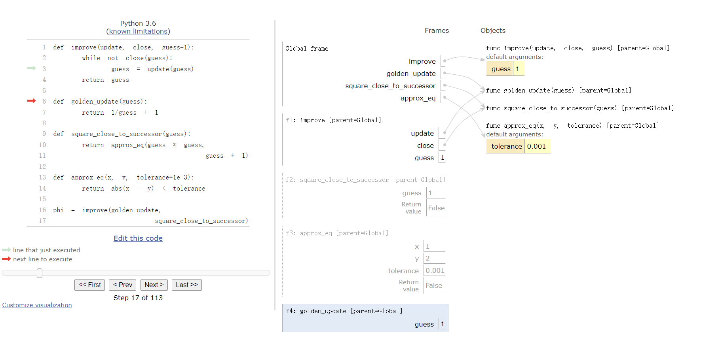

1.6 高阶函数

> 来源：[1.6   Higher-Order Functions](http://composingprograms.com/pages/16-higher-order-functions.html)

我们已经看到，函数实际上是描述复合操作的抽象，这些操作不依赖于它们的参数值。在`square`中，

```python
>>> def square(x):
        return x * x
```

我们不会谈论特定数值的平方，而是谈论一个获得任何数值平方的方法。当然，我们可以不定义这个函数来使用它，通过始终编写这样的表达式：

```python
>>> 3 * 3
9
>>> 5 * 5
25
```

并且永远不会显式提及`square`。这种做法对于简单的计算（例如 square）来说已经足够了，但对于更复杂的例子（例如 abs 或 fib）来说就变得很困难了。一般来说，缺少函数定义会使我们处于不利地位，迫使我们只能使用语言提供的操作(在这种情况下为乘法)而不是使用更高级别的操作。我们的程序将能够计算平方，但我们的语言将缺乏表达平方概念的能力。

我们对一个强大的编程语言的要求之一：通过将名称分配给常见模式然后直接根据名称进行工作来构建抽象的能力。函数提供了这种能力。

我们将会在下个例子中看到，有一些常见的编程模式在代码中重复出现，但是使用一些不同函数来实现。

为了将某些通用模式表示为某种确定的概念  ，我们需要构造可以接受其他函数作为参数或将函数作为返回值的函数。 操作函数的函数称为高阶函数。 本节展示了高阶函数如何作为强大的抽象机制，极大地提高我们语言的表达能力。

## 1.6.1 作为参数的函数

考虑下面三个函数，它们都计算总和。第一个`sum_naturals`，计算截至`n`的自然数的和：

```python
>>> def sum_naturals(n):
        total, k = 0, 1
        while k <= n:
            total, k = total + k, k + 1
        return total
>>> sum_naturals(100)
5050
```

第二个`sum_cubes`，计算截至`n`的自然数的立方和：

```python
>>> def sum_cubes(n):
        total, k = 0, 1
        while k <= n:
            total, k = total + pow(k, 3), k + 1
        return total
>>> sum_cubes(100)
25502500
```

第三个，计算这个级数中式子的和(称式1)：


它会慢慢收敛于`pi`。

```python
>>> def pi_sum(n):
        total, k = 0, 1
        while k <= n:
            total, k = total + 8 / (k * (k + 2)), k + 4
        return total
>>> pi_sum(100)
3.121594652591009
```

这三个函数都具有相同模式。它们大部分相同，只是名字、用于计算被加项的`k`的函数，以及提供`k`的下一个值的函数不同。我们可以用下面的模板通过把 槽位变成形式参数来生成具有同种模式的函数：

```python
def <name>(n):
    total, k = 0, 1
    while k <= n:
        total, k = total + <term>(k), <next>(k)
    return total
```

这个常见模式的出现是一个强有力的证据，表明有一种有用的抽象正在等待浮出水面。这些函数的每一个都是用来计算某个式子的总和。作为程序的设计者，我们希望我们的语言足够强大，以便我们可以编写一个表达求和概念的函数，而不仅仅是计算特定求和的函数。

在下面的示例中，`summation` 将上限 `n` 以及计算第 k 项的函数`term`作为它的两个参数。 我们可以像使用任何函数一样使用 `summation`，它简洁地表达了 `summations`。 花点时间逐步完成此示例，并注意如何将`cube`绑定到本地名称`term`以确保计算`1*1*1 + 2*2*2 + 3*3*3 = 36`得到的结果是正确的。 在这个例子中，不再需要的帧被移除以节省空间。


我们可以把` identity `函数作为参数调用`summation`函数或者使用`sum_naturals` 函数来对自然数求和(结果一致)。

```python
>>> def summation(n, term):
        total, k = 0, 1
        while k <= n:
            total, k = total + term(k), k+1
        return total

>>> def identity(x):
        return x    
    
>>> def sum_naturals(n):
        return summation(n, identity)
    
>>> sum_naturals(10)
55    
```

`summation` 函数也可以直接调用，无需为特定序列定义另一个函数。

```python
>>> summation(10, square)
385
```

我们可以使用`summation`函数来定义 `pi_sum`, 我们在`pi_sum`函数中使用`n`和函数`pi_term`作为参数来调用`summation`函数来计算`1e6`这个级别式1的值。 我们传递参数`1e6`，它是`1 * 10^6 = 1000000`的简写，以生成对 pi (圆周率)的近似值。

```python
>>> def pi_term(x):
        return 8 / ((4*x-3) * (4*x-1))
    
>>> def pi_sum(n):
        return summation(n, pi_term)
    
>>> pi_sum(1e6)
3.141592153589902
```


## 1.6.2 作为一般方法的函数

我们引入用户定义函数作为抽象数值运算模式的机制，从而使它们独立于所涉及的特定数字。对于高阶函数，我们开始看到一种更强大的抽象：一些函数表达了通用的计算方法，独立于它们调用的特定函数。

在概念上函数的意义被扩展了，我们对于如何求解调用表达式的环境模型也优雅地延伸到了高阶函数的情况，无需更改。当用一些实参(对用来调用一个函数所用参数的称呼)调用一个用户定义函数时，在新的局部帧中形式参数绑定到这些实参（可能是函数）的值。

考虑下面的例子，我们实现了通用方法` improve`函数并使用它来计算黄金比例。黄金比例，通常称为“phi”，是一个接近 1.6 的数字。

` improve`函数从形参`guess`的值开始。它不断调用`update`函数来使`guess`的值更加靠近“phi”，并且调用`close`来检查当前的`guess`是否“足够接近” "phi"。

```python
>>> def improve(update, close, guess=1):
        while not close(guess):
            guess = update(guess)
        return guess
```

函数`improve` 没有指定正在解决什么问题：这些细节留给作为参数传入的`update`和`close`函数。

黄金比例的特性之一是它可以通过重复将任何正数的倒数与 1 相加来计算“phi”，并且它(正数的倒数+1 )比它的平方小 1。 我们可以将这些特性与`improve`函数一起使用。

```python
>>> def golden_update(guess):
        return 1/guess + 1
>>> def square_close_to_successor(guess):
        return approx_eq(guess * guess, guess + 1)
```

上面，我们引入了对` approx_eq `的调用，如果它的两个参数的值近似相等，则返回 True。 为了实现`approx_eq`，我们可以将两个数字之间差异的绝对值与一个小的容差值进行比较。

```python
>>> def approx_eq(x, y, tolerance=1e-5):
        return abs(x - y) < tolerance
```

使用`golden_update`和`square_close_to_successor`作为参数来调用`improve`会计算出黄金比例的近似值。

```python
>>> improve(golden_update, square_close_to_successor)
1.6180371352785146
```

通过跟踪计算“phi”近似值的过程，我们就可以观察如何计算出“phi”的近似值。首先，用`update`、`close`和`guess`构建`improve`局部帧。在`improve`的函数体中，名称`close`绑定到`square_close_to_successor`上，用`guess`(初始值)调用`close`。跟踪其余的步骤，以查看黄金比例的计算过程



这个扩展后的例子展示了计算机科学中两个重要概念。首先，命名和函数允许我们抽象出大量的复杂性。虽然每个函数定义都是微不足道的，但由我们的计算程序启动的计算过程是非常复杂的。其次，正是由于Python 有一个非常通用的计算程序，小组件才能组合成复杂的程序。了解 解释 程序的过程使我们能够验证和检查我们创建的程序

像通常一样，我们的新的`improve`函数需要测试来检查正确性。黄金比例可以提供这样一个测试，因为它也有一个闭式解，我们可以将它与迭代结果进行比较。

```python
>>> from math import sqrt
>>> phi = 1/2 + sqrt(5)/2
>>> def improve_test():
        approx_phi = improve(golden_update, square_close_to_successor)
        assert approx_eq(phi, approx_phi), 'phi differs from its approximation'
>>> improve_test()
```

对于这个测试，没有消息就是好消息：improve_test 在它的 assert 语句执行成功后返回 None。


## 1.6.3 定义函数 III：嵌套定义

上面的例子演示了将函数作为参数传递的能力如何提高了编程语言的表现力。每个通用的概念或方程都映射到自己的小型函数上，这中方法的一个负面后果是全局帧会被小型函数弄乱,同一个环境中的函数的名称必须都是唯一的。另一个问题是我们受到特定函数签名的限制：`improve `的`update`参数必须只接受一个参数。Python 中，嵌套函数定义解决了这些问题，但需要我们丰富我们的环境模型。

让我们考虑一个新问题：计算一个数的平方根。重复调用下面的`sqrt_update`函数会得到一个靠近`x`平方根的值：

```python
>>> def average(x, y):
        return (x + y)/2
>>> def sqrt_update(guess, x):
        return average(guess, x/guess)
```

这个带有两个参数的`sqrt_update`函数和`improve`不兼容(问题1)，`sqrt_update`函数只提供一次更新(问题2)。而我们真正关心的是通过重复调用`sqrt_update`函数来得到一个在误差范围内靠近`x`平方根的值。 这两个问题的解决方案**是在函数中定义函数**

```python
>>> def sqrt(a):
        def sqrt_update(x):
            return average(x, a/x)
        def sqrt_close(x):
            return approx_eq(x * x, a)
        return improve(sqrt_update, sqrt_close)
```

就像局部赋值一样，局部的`def`语句仅仅影响当前的局部帧。`sqrt`函数中`def`语句仅在调用`sqrt`时才会计算。当调用`sqrt`会创建一个局部帧，在`sqrt`函数中定义的函数就在这个帧中

**词法作用域**：局部定义的函数还可以访问定义它们的范围内的名称绑定。这个例子中，`sqrt_update`引用了名称`x`，它是外层函数`sqrt`的一个形参。这种在嵌套函数中共享名称的规则叫做词法作用域。


我们需要对我们环境模型进行两个扩展以启用词法作用域。

1.  每个用户定义的函数都有一个父环境：定义它的环境。
2.  当调用用户定义的函数时，它的局部帧会被扩展以能够访问它父环境中的名称。

回到`square`，所有函数都在全局环境中定义，所以他们都有相同的父环境：全局环境。

当 Python 执行函数` sqrt` 内部的两个def语句时，它会创建两个与本地环境(python为`sqrt`函数创造的环境，这里用环境1代指)相关联的函数。在

```python
>>> sqrt(256)
16.0
```

的调用中，环境1首先为 `sqrt`函数创建一个本地帧，并计算` sqrt_update` 和 `sqrt_close` 函数的 def 语句。


每个函数都有一个新的注释，我们将从现在起将其包含在环境图中，即*parent*注释（指明一个函数的父环境是谁）。函数的父环境是定义该函数的环境的第一帧。没有*parent*注释的函数是在全局环境中定义的。当调用用户定义的函数时，会创建的一个帧，该帧与该函数具有相同的父环境

随后，定义`sqrt_update`和`sqrt_close`函数，并将这两个函数名作为参数调用`improve`函数。在`improve`的函数体中，我们把`guess`作为参数来调用 `update` 函数（`update`绑定到 `sqrt_update`,`x`绑定到`guess`）。最后调用 `sqrt_update`函数并创建了一个仅包含 `x` 的本地帧的环境


此计算过程中最关键的部分是把`sqrt_update`函数的父环境作为调用`sqrt_update`创建的帧的父环境。这个帧也用`[parent=f1]`注释。

**扩展环境**：一个环境由一系列帧组成并且总是以全局帧结束。在此 `sqrt`示例之前，环境最多有两个帧：局部帧和全局帧。通过调用在其他函数中定义的函数，我们可以扩展我们的环境。调用`sqrt_update`的环境由三个帧组成：本地 `sqrt_update`帧、定义了`sqrt_update`的`sqrt`帧（标记为`f1`）和全局帧。

`sqrt_update`函数中的返回表达式可以通过遵循此帧链来解析 `a` 的值。查找名称会找到当前环境中绑定到该名称的第一个值。Python 首先在`sqrt_update`帧中检查——不存在`a`。Python 在父帧`f1 `中检查下一个，并找到与`a`绑定的值。

所以我们意识到了词法作用域的两个关键优势。

+ 局部函数的名称并不影响定义所在函数外部的名称，因为局部函数的名称绑定到了定义处的当前局部环境中，而不是全局环境。

+ 局部函数可以访问外层函数的环境。因为局部函数的函数体是在环境2计算的，环境2扩展了定义它的计算环境。

  

`sqrt_update`函数自带了一些数据：在定义`sqrt_update`函数的环境中引用的值


## 1.6.4 作为返回值的函数

通过创建返回值本身就是函数的函数，我们可以在我们的程序中实现更强大的表达能力。有词法作用域的编程语言的一个重要特性就是，局部定义函数在返回时保持其父环境。以下示例说明了此功能的实用性。

在定义了许多简单函数之后，`composition`是包含在我们的编程语言中的自然组合法。也就是说，提供两个函数`f(x)`和`g(x)`，我们可能想要定义`h(x) = f(g(x))`。我们可以使用现有工具来定义组合函数：

```python
>>> def compose1(f, g):
        def h(x):
            return f(g(x))
        return h
```

本示例的环境图显示了名称`f`和`g` 是如何正确解析的，即使存在名称冲突也是如此。


`compose1`中的`1`表明组合函数都只接受一个参数。这种命名惯例并不由解释器强制执行的，`1`只是函数名称的一部分。

一个实例

```python
def square(x):
    return x * x


def successor(x):
    return x + 1


def compose1(f, g):
    def h(x):
        return f(g(x))

    return h


def f(x):
    """Never called."""
    return -x


square_successor = compose1(square, successor)
result = square_successor(12)
```

这里，我们努力精确定义计算环境模型的好处。我们的环境模型不需要任何修改就能支持以这种方式返回函数的能力。


## 1.6.5 示例：牛顿法

最后的扩展示例展示了函数值、局部定义如何协同工作以简洁地表达一般思想。我们将实现一种广泛用于机器学习、科学计算、硬件设计和优化的算法

牛顿法是一个经典的迭代方法，用于寻找使数学函数返回值为零的参数。这些值称为这些函数的零点。寻找一个函数的零点通常等同于解决一些其他感兴趣的问题，例如计算平方根。

在我们继续之前的评论：我们认为计算平方根是很容易的。不仅是 Python，你的手机和计算机等都可以为你做这件事。但是，学习计算机科学的一部分是弄懂如何计算这些数，这里介绍的一般方法适用于解决 Python 内置方程之外的一大类方程。

牛顿法是一种迭代改进算法：它改进了对任何可微函数的零点的猜测值，这意味着它可以在任何点用一条直线来近似。 牛顿法通过这些线性近似来找到函数零点。

想象经过点`(x, f(x))`的一条直线，它与函数`f(x)`的曲线在这一点的斜率相同。这样的直线叫做切线，它的斜率叫做`f`在`x`上的导数。

这条直线的斜率是函数值改变量与函数参数改变量的比值。因此，通过 `f(x) `除以斜率来平移 `x `将得到该切线接触 0 时的参数值。


`newton_update`表达了沿着这条切线到 0 的计算过程，对于函数 f 和它的导数 df

```python
>>> def newton_update(f, df):
        def update(x):
            return x - f(x) / df(x)
        return update
```

最后，我们可以根据 `newton_update`、`improve`以及比较 f(x) 是否接近 0 来定义 find_root 函数。

```python
>>> def find_zero(f, df):
        def near_zero(x):
            return approx_eq(f(x), 0)
        return improve(newton_update(f, df), near_zero)
```

我们使用牛顿法来计算根 ，我们可以计算任意n次方根。 a 的 n 次方根是 x，n个x相乘=a。 例如，

- 64 的平方（第二个）根是 8，因为 8⋅8=64。
- 64 的三次方根是 4，因为 4⋅4⋅4=64。
- 64 的六次方根是 2，因为 2⋅2⋅2⋅2⋅2⋅2=64

我们可以使用牛顿法计算根，观察结果如下：

+ 64的平方根是满足`square(x) - 64 = 0`的`x`值。
+ 更一般地，a 的 n 次根是满足`pow(x, n) - a = 0`的`x`值。

如果我们能找到最后一个方程的零点，那么我们就可以计算 n 次根，通过绘制 n 等于 2、3 ， 6 以及 a 等于 64 的曲线，我们可以形象化这种关系。


我们首先通过定义 `f` 及其导数 `df` 来实现 `square_root`。 我们从微积分中使用 f(x)=x*x−a 的导数是线性函数` df(x)=2x` 

```python
>>> def square_root_newton(a):
        def f(x):
            return x * x - a
        def df(x):
            return 2 * x
        return find_zero(f, df)
>>> square_root_newton(64)
8.0
```

推广到任意n次方的根
$$
我们计算 f(x)=x^n−a 及其导数 df(x)=n⋅xn−1。
$$

```python
>>> def power(x, n):
        """Return x * x * x * ... * x for x repeated n times."""
        product, k = 1, 0
        while k < n:
            product, k = product * x, k + 1
        return product
>>> def nth_root_of_a(n, a):
        def f(x):
            return power(x, n) - a
        def df(x):
            return n * power(x, n-1)
        return find_zero(f, df)
>>> nth_root_of_a(2, 64)
8.0
>>> nth_root_of_a(3, 64)
4.0
>>> nth_root_of_a(6, 64)
2.0
```

通过将`tolerance`中 `approx_eq`的值更改为较小的数字，可以减少所有这些计算中的近似误差。

当您尝试牛顿方法时，请注意它不会总是收敛。`improve`的初始`guess`必须足够接近0，并且必须满足有关该函数的各种条件。虽然具有这些缺陷，牛顿法是求解可微方程的一种强大的通用计算方法。对数和大整数除法的非常快速的算法，在现代计算机该算法中采用了该技术的变体。


## 1.6.6  柯里化

- 柯里化：通过高阶函数(`HOF`)将带有多个参数的函数转换为一个函数链，每个函数接受单参数

具体的说，通过定义高阶函数 g，使得 g(x)(y) == f(x, y)。

例如，我们可以定义 pow 函数的柯里化版本：

```python
>>> def curried_pow(x):
        def h(y):
            return pow(x, y)
        return h
>>> curried_pow(2)(3)
8
```

> 当我们需要一个只接受一个参数的函数时，柯里化很有用

例如，映射模式将单参数函数应用于值序列，我们可以在函数中实现该模式：

````python
>>> def map_to_range(start, end, f):
        while start < end:
            print(f(start))
            start = start + 1
````

我们可以使用` map_to_range` 和` curried_pow `来计算 2 的前十次幂，而不是专门编写一个函数.

```python
>>> map_to_range(0, 10, curried_pow(2))
1
2
4
8
16
32
64
128
256
512
```

我们可以类似地使用相同的两个函数来计算其他数字的幂。 柯里化允许我们这样做，而无需为我们希望计算其幂的每个数字编写特定的函数。

在上面的例子中，我们手动对 pow 函数进行了柯里化变换，得到了 `curried_pow`。 相反，我们可以定义函数来自动化柯里化，以及逆反柯里化转换：

```python
>>> def curry2(f):
        """Return a curried version of the given two-argument function."""
        def g(x):
            def h(y):
                return f(x, y)
            return h
        return g
>>> def uncurry2(g):
        """Return a two-argument version of the given curried function."""
        def f(x, y):
            return g(x)(y)
        return f
>>> pow_curried = curry2(pow)
>>> pow_curried(2)(5)
32
>>> map_to_range(0, 10, pow_curried(2))
1
2
4
8
16
32
64
128
256
512
```

 函数`curry2`接受一个双参数函数 `f` 并返回一个单参数函数 `g`。 当用参数`x`调用`g`时，返回一个单参数函数 `h`。当用参数`y`调用`h`时，它调用 `f(x, y)`。 因此，`curry2(f)(x)(y)` ==`f(x, y)`。 `uncurry2` 函数反转了柯里化变换，使得 `uncurry2(curry2(f))` == f。

```python
>>> uncurry2(pow_curried)(2, 5)
32
```


## 1.6.6 Lambda 表达式

到目前为止，每次我们想要定义一个新函数时，我们都需要给它一个名字。 但是对于其他类型的表达式，我们不需要将中间值与名称相关联。也就是说，我们可以计算`a*b + c*d`，而不需要给子表达式`a*b`或`c*d`，或整个表达式一个名字。Python 中，们可以使用 lambda 表达式动态创建函数， 一个 lambda 表达式的计算结果是一个匿名函数，lambda 表达式有一个单一的返回表达式作为它的主体。 且不允许赋值和控制语句。

Lambda 表达式十分受限：它们仅仅可用于简单的单行函数，求解和返回一个表达式。在它们适用的特殊情形中，Lambda 表达式具有强大的表现力。

```python
>>> def compose1(f,g):
        return lambda x: f(g(x))
```

我们可以通过构造相应的英文语句来理解 Lambda 表达式：

```py
     lambda            x            :          f(g(x))
"A function that    takes x    and returns     f(g(x))"
```

lambda 表达式的计算结果称为 lambda 函数。 它没有内置名称（因此 Python 打印 <lambda> 作为名称），但除此之外它的行为与任何其他函数一样。

```python
>>> s = lambda x: x * x
>>> s
<function <lambda> at 0xf3f490>
>>> s(12)
144
```

在环境图中，lambda 表达式以希腊字母 λ (lambda) 命名。 我们的 `compose1` 函数可以用 lambda 表达式表达。

```python
def compose1(f, g):
    return lambda x: f(g(x)) 
    
f = compose1(lambda x: x * x, lambda y: y + 1) 

result = f(12)
```

一些程序员发现使用 Lambda 表达式作为匿名函数非常简短和直接。但是，复合的 Lambda 表达式非常难以辨认，尽管它们很简洁。下面的定义是是正确的，但是许多程序员不能很快地理解它：

```python
>>> compose1 = lambda f,g: lambda x: f(g(x))
```

通常，Python 的代码风格倾向于使用`def`语句而不是 Lambda 表达式，但在需要简单函数作为参数或返回值的情况下使用它们

这种风格规范不是准则，你可以想怎么写就怎么写，但是，在你编写程序时，请考虑有一天可能会阅读您的程序的人们。 当你能让你的程序更容易理解时，你就是在帮那些人一个忙

Lambda 表达式和函数调用，以及 Lambda 演算都成为了计算机科学概念的基础，并在 Python 编程社区广泛传播。当我们在第 3 章研究解释器的设计时，我们将重新讨论这个话题。


## 1.6.7 抽象和一等函数

本节开始时我们观察到用户定义函数是一种关键的抽象机制，因为它们允许我们将通用计算方法表示为我们编程语言中的显式元素。现在我们已经看到高阶函数怎样允许我们操纵这些通用方法来创建进一步的抽象。

作为程序员，我们应该注意识别程序中底层抽象的机会，在它们的基础上进行构建，并概括它们以创建更强大的抽象。这并不是说我们总是应该以最抽象的方式编写程序；资深程序员知道如何选择适合他们任务的抽象级别。但重要的是能够从这些抽象的角度进行思考，以便我们准备好将它们应用到新的上下文中。高阶函数的重要性在于它们使我们能够将这些抽象明确表示为我们编程语言中的元素，以便它们可以像其他计算元素一样被处理。

一般来说，编程语言对计算元素的操作方式施加了限制。具有最少限制的元素具有一流的地位。一等元素的一些“权利和特权”是：

1. 它们可能与名称绑定。
2. 它们可以作为参数传递给函数。
3. 它们可以作为函数的结果返回。
4. 它们可能包含在数据结构中。

Python 授予函数一流的地位，由此带来的表达能力的提升是巨大的。


## 1.6.8 函数装饰器

Python 提供了特殊的语法，将高阶函数作为执行`def`语句的一部分，叫做装饰器。也许最常见的例子是追踪，它在查看函数什么时候递归调用时很有用


```python
>>> def trace1(fn):
        def wrapped(x):
            print('-> ', fn, '(', x, ')')
            return fn(x)
        return wrapped
    
>>> @trace1
    def triple(x):
        return 3 * x
    
>>> triple(12)
->  <function triple at 0x102a39848> ( 12 )
36
```

`triple`的`def`语句拥有一个注解，`@trace1`，它会影响`def`的执行规则。函数`triple`被创建,但是名称`triple`绑定到用`triple`作为参数去调用函数`trace` 的返回值上。 这个装饰器相当于

```py
>>> def triple(x):
        return 3 * x
>>> triple = trace1(triple)
```

在与本文相关的项目中，装饰器用于跟踪，以及在从命令行运行程序时选择要调用的函数

**附加部分：**装饰符@ 也可以跟在调用表达式之后。 @后面的表达式先求值（就像上面对名称trace求值一样），然后是`def`语句，最后将装饰器表达式的求值结果应用到新定义的函数上，结果绑定到名称中 def 声明。
