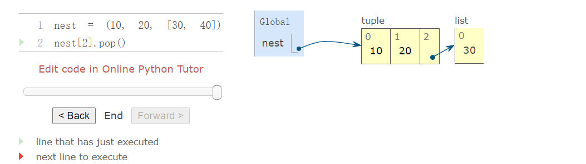
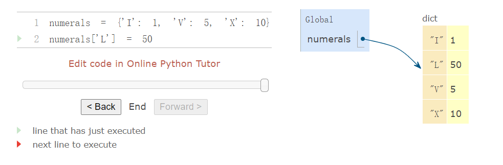
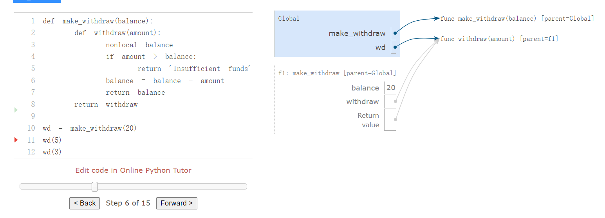
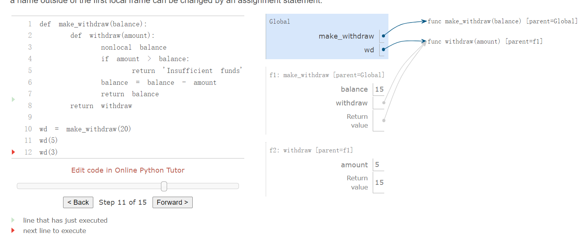
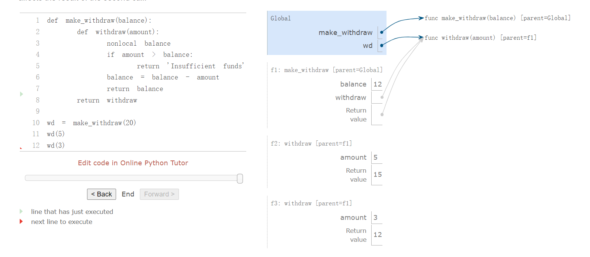
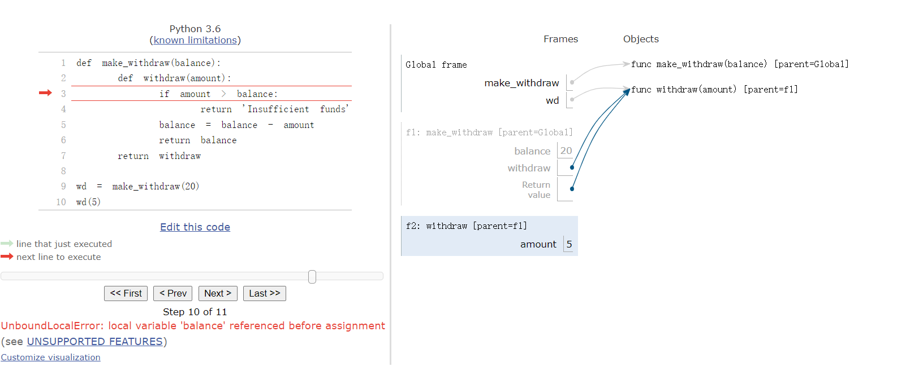
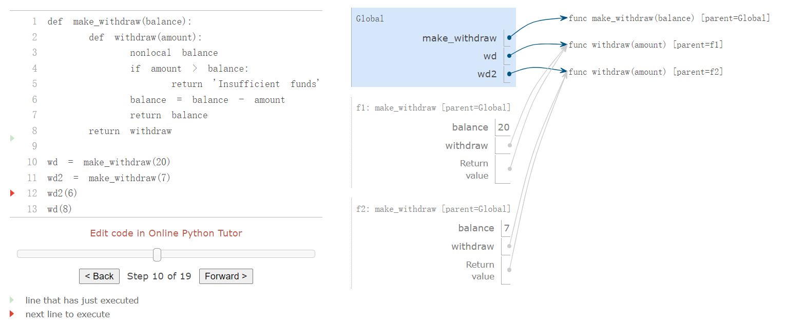
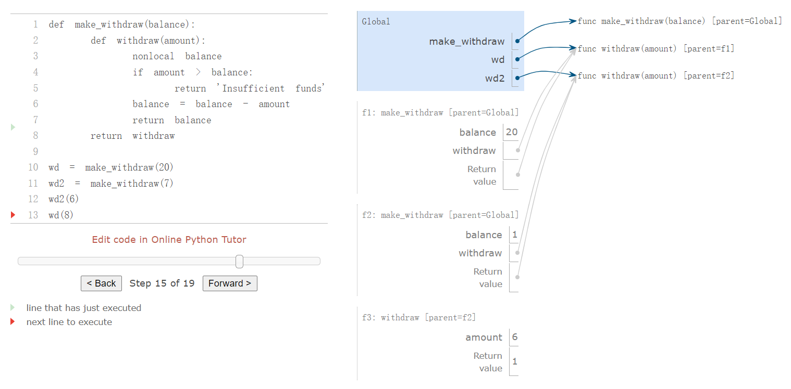
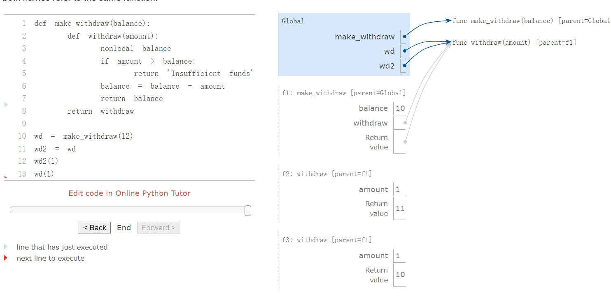
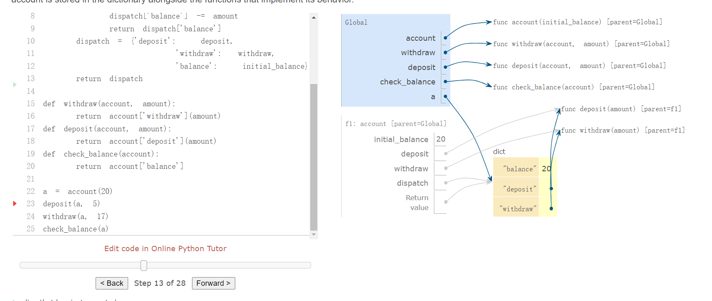

# 2.4 可变数据

> 来源：[2.4   Mutable Data](http://composingprograms.com/pages/24-mutable-data.html)


我们已经看到抽象在帮助我们应对大型系统的复杂性方面是多么重要。有效的编程还需要可以指导我们制定程序总体设计的组织原则。特别是，我们需要策略来帮助我们构建模块化的大型系统，这意味着它们可以自然地分成可以单独开发和维护的连贯部分。

创建模块化程序的一项强大技术是合并可能会随时间改变状态的数据。通过这种方式，单个数据对象可以代表独立于程序其余部分发展的东西。一个不断变化的对象的行为可能会受到其历史的影响，就像世界上的一个实体一样。向数据添加状态是称为面向对象编程范式的核心要素


## 2.1.1 对象隐喻

在本文的开始，我们区分了函数和数据：函数执行操作，而数据被操作。当我们在数据中包含函数值时，我们承认数据也可以拥有行为。函数可以作为数据进行操作，但也可以被调用来执行计算。

对象将数据值与行为相结合。 对象代表信息，但也表现得像它们所代表的事物。 对象如何与其他对象交互的逻辑与编码对象值的信息捆绑在一起。 当一个对象被打印出来时，它知道如何在文本中把自己拼写出来。 如果一个对象是由部分组成的，它就知道如何按需显示这些部分。 对象既是信息又是过程，它们捆绑在一起以表示复杂事物的属性、交互和行为。

对象行为在 Python 中通过专门的对象语法和相关术语来实现，我们可以通过示例进行介绍。 日期（`date`）是一种对象 

```python
>>> from datetime import date
```

`date`的名字绑定到了一个类上面。类表示一类值。单个日期叫做这个类的实例，它们可以通过用参数调用这个类来构造，这些参数描述了实例。


```python
>>> tues = date(2014, 5, 13)
```

虽然`tues`是由基本数值构造的，但它的行为就像一个日期那样。例如，将它与另一个日期相减会得到时间差，我们可以打印出来。

```py
>>> print(date(2014, 5, 19) - tues)
6 days, 0:00:00
```

对象拥有属性，它们是带有名字的值，也是对象的一部分。Python 中，我们使用点运算符来访问对象属性：

```
<expression> . <name>
```

上面的`<expression>`计算为一个对象，`<name>`是对象的某个属性的名称。

不像我们之前见过的名称，这些属性名称在一般的环境中不可用。反之，属性名称是点运算符之前的对象实例的特定部分。

```python
>>> tues.year
2014
```

对象也拥有方法，它是值为函数的属性。比喻地说，我们说对象“知道”如何执行这些方法。方法是根据参数和对象计算结果的函数。例如，`tues`的`strftime`方法（（一个经典的函数名称，关于“时间的字符串格式”））单个参数来指定如何显示日期（例如，%A 意味着应该完整地显示星期几）

```python
>>> tues.strftime('%A, %B %d')
'Tuesday, May 13'
```

计算`strftime`的返回值需要两个输入：描述输出格式的字符串，以及绑定到`tues`的日期信息。这个方法使用日期特定的逻辑来产生结果。我们从不会说2014 年 5 月 13 日是星期二，但是知道一个人的工作日是日期的一部分。通过将行为和信息捆绑在一起，Python 对象提供了可靠、独立的日期抽象。

日期是对象，但数字、字符串、列表和范围也是对象。 它们代表一种值，但也要以适合它们代表的值的方式行事。 它们也有属性和方法。 例如，字符串具有一组便于文本处理的方法。 ...

```python
>>> '1234'.isnumeric()
True
>>> 'rOBERT dE nIRO'.swapcase()
'Robert De Niro'
>>> 'eyes'.upper().endswith('YES')
True
```

实际上，Python 中的所有值都是对象。 也就是说，所有值都有行为和属性。 他们的行为就像他们所代表的值。


## 2.4.2  Sequence Objects

基本内置值（例如数字）的实例是不可变的。 值本身不能在程序执行过程中改变。 另一方面，列表是可变的。

可变对象用于表示随时间变化的值。 一个人从一天到下一天都是同一个人，尽管变老、理发或以其他方式改变了。 类似地，由于变异操作，对象可能具有不断变化的属性。 例如，可以更改列表的内容。 大多数更改是通过调用列表对象上的方法来执行的。

我们可以通过一个说明扑克牌历史的例子来介绍很多列表修改操作。 示例中的注释描述了每个方法调用的效果。

> **列表的元素是可修改的**(修改的是引用变量的值)

扑克牌是在中国发明的，大概在 9 世纪左右。 早期的牌有有三种花色，对应于货币的面额。

```python
>>> chinese = ['coin', 'string', 'myriad']  # 列表字面值
>>> suits = chinese                         # 两个名字指的是同一个列表
```

随着纸牌传到欧洲，西班牙的牌组中只保留了硬币的花色。

```python
>>> suits.pop()             #删除并返回最后一个元素
'myriad'
>>> suits.remove('string')  # 删除与参数相等的第一个元素
```

添加了另外三种花色，

````python
>>> suits.append('cup')              # 在最后添加一个元素
>>> suits.extend(['sword', 'club'])  # 将序列的所有元素添加到末尾
````

意大利人把剑叫做“黑桃”：

```python
>>> suits[2] = 'spade'  # 替换一个元素
```

使用传统意大利纸牌的花色

```python
>>> suits
['coin', 'cup', 'spade', 'club']
```

今天在美国使用的法国变体改变了前两两花色：

```python
>>> suits[0:2] = ['heart', 'diamond']  # Replace a slice
>>> suits
['heart', 'diamond', 'spade', 'club']
```

还存在用于插入、排序和反转列表的方法。 所有这些变异操作都会改变列表的值； 它们不会创建新的列表对象。

共享身份:因为我们一直在更改单个列表而不是创建新列表，所以绑定到名称` chinese` 的对象也发生了变化，因为它是绑定到`suits`的同一个列表对象！

```python
>>> chinese  # This name co-refers with "suits" to the same changing list
['heart', 'diamond', 'spade', 'club']
```

这种行为是新的。 以前，如果名称未出现在语句中，则其值不会受到该语句的影响。 对于可变数据，调用一个名称的方法可以同时影响另一个名称。

此示例的环境图显示了绑定到 `chinese` 的值如何被更改的。 逐步执行以下示例的每一行以观察这些更改。

在[运行下面的代码](https://pythontutor.com/composingprograms.html#mode=edit)以获得此示例的环境图，它显示了绑定到 `chinese` 的值如何被更改的。 逐步执行以下示例的每一行以观察这些更改。

```python
chinese = ['coin', 'string', 'myriad']
suits = chinese
suits.pop()
suits.remove('string')
suits.append('cup')
suits.extend(['sword', 'club'])
suits[2] = 'spade'
suits[0:2] = ['heart', 'diamond']
```

可以使用构造函数`list`来复制列表。 对一个列表的更改不会影响另一个列表，除非它们共享结构。

```python
>>> nest = list(suits)  # Bind "nest" to a second list with the same elements
>>> nest[0] = suits     # Create a nested list
```

根据这个环境，改变`suits`引用的列表，会影响`nest`的第一个元素(列表)，但不会影响其他元素。

```python
>>> suits.insert(2, 'Joker')  # Insert an element at index 2, shifting the rest
>>> nest
[['heart', 'diamond', 'Joker', 'spade', 'club'], 'diamond', 'spade', 'club']
```

同样，在` nest` 的第一个元素中撤消此更改也会更改`suit`。

```python
>>> nest[0].pop(2)
'Joker'
>>> suits
['heart', 'diamond', 'spade', 'club']
```

在[运行下面的代码](https://pythontutor.com/composingprograms.html#mode=edit)以获得此示例的环境图，逐行浏览此示例将显示嵌套列表的表示。

```python
suits = ['heart', 'diamond', 'spade', 'club']
nest = list(suits)
nest[0] = suits
suits.insert(2, 'Joker')
joke = nest[0].pop(2)
```

因为两个列表可能有相同的内容但实际上是不同的列表，所以我们需要一种方法来测试两个对象是否相同。 Python 包含两个比较运算符，称为 `is `和 `is not`，用于测试两个表达式实际上是否计算为相同的对象。 如果两个对象的当前值相等，则它们是相同的，并且对一个对象的任何更改都将始终反映在另一个对象中。 身份是比`==`更强的条件。

> **is :不要用于字符串和数值**，除非你有明确地理由否则别用
>
> 注：两个对象当且仅当在内存中的位置相同时为同一个对象。`CPython` 的实现直接比较对象的地址来确定。

```python
>>> suits is nest[0]
True
>>> suits is ['heart', 'diamond', 'spade', 'club']
False
>>> suits == ['heart', 'diamond', 'spade', 'club']
True
```

最后两个比较说明了 `is` 和 `== `之间的区别。 前者检查身份，而后者检查内容是否相等。

**列出理解**：列表推导式总是会创建一个新列表。 例如，`unicodedata` 模块跟踪 `Unicode` 字母表中每个字符的正式名称。 我们可以查找名称对应的字符，包括suit卡片的字符。

```python
>>> from unicodedata import lookup
>>> [lookup('WHITE ' + s.upper() + ' SUIT') for s in suits]
['♡', '♢', '♤', '♧']
```

此结果列表不与`suit`共享它的任何内容，对结果列表的任何操作都不会影响`suits`的值。

您可以在 Dive into Python 3 的 [Unicode](https://finderiko.com/python-book#one-ring-to-rule-them-all) 部分中阅读有关用于表示文本的 Unicode 标准的更多信息。


**元组**： 元组是内置的一种不可变的**序列**。 元组是使用元组字面量创建的，该字面量用逗号分隔元素。 括号是可选的，但在实践中经常使用。 任何对象都可以放在元组中。

```python
>>> 1, 2 + 3
(1, 5)
>>> ("the", 1, ("and", "only"))
('the', 1, ('and', 'only'))

>>> type( (10, 20) )
<class 'tuple'>
```

空元组和单元素元组具有特殊的语法。

```python
>>> ()    # 0 elements
()
>>> (10,) # 1 element
(10,)
```

元组是序列的一种

```python
>>> code = ("up", "up", "down", "down") + ("left", "right") * 2
>>> len(code)
8
>>> code[3]
'down'
>>> code.count("down")
2
>>> code.index("left")
4
```

操作列表内容的方法不适用于元组，因为元组是不可变的。

虽然无法更改元组中的元素，但可以更改元组中包含的可变元素的值。




元组在多重赋值中隐式使用。 将两个值分配给两个名称会创建一个双元素元组，然后将其解包。


 ## 2.4.3 字典 

字典是 Python 的内置数据类型，用于存储和处理对应关系。 字典包含键值对，其中键和值都是对象。 字典的目的是提供一种抽象，用于存储和检索不是由连续整数索引的值，而是由描述性键索引的值。

字符串通常用作键，因为字符串是我们对事物名称的常规表示。 这个字典字面值给出了各种罗马数字

```python
>>> numerals = {'I': 1.0, 'V': 5, 'X': 10}
```

通过键查找值使用了元素选择运算符。

```python
>>> numerals['X']
10
```

字典中的每个键的值不能重复。 添加新的键值对和更改键的现有值都可以通过赋值语句来实现。

```python
>>> numerals['I'] = 1
>>> numerals['L'] = 50
numerals['V'] += 50
>>> numerals
{'I': 1, 'X': 10, 'L': 50, 'V': 55}
```

请注意，'L' 未添加到上述输出的末尾。 字典是键值对的无序集合。 当我们打印字典时，键和值按某种顺序呈现，但作为该语言的用户，我们无法预测该顺序是什么。 多次运行程序时，顺序可能会改变。

字典也可以出现在环境图中。



字典类型还支持对整个字典内容进行迭代的各种方法。 键、值和项的方法都返回可迭代的值。

```python
>>> sum(numerals.values())
66
```

可以通过调用  构造函数`dict`将键值对列表转换为字典。

```python
>>> dict([(3, 9), (4, 16), (5, 25)])
{3: 9, 4: 16, 5: 25}
```

字典确实有一些限制：

- 字典的键不能是或包含可变值。
- 一个字典的键的值不能重复出现在这个字典里

第一个限制与 Python 中字典的底层实现相关。 这个实现的细节不是本文的主题。 直观地说，键告诉 Python 在哪里可以找到内存中的键值对； 如果键改变，则该对的位置可能会丢失。 元组通常用于字典中的键，因为其不可变。

第二个限制是字典抽象的结果，它旨在存储和检索键的值。 如果字典中最多存在一个这样的值，我们能检索键的值。

字典实现的一个有用的方法` get`，它返回键的值（如果键存在）或默认值。 get 的参数是键和默认值。

```python
>>> numerals.get('A', 0)
0
>>> numerals.get('V', 0)
5
>>> bob.get("pavo", "🤔")  #如果pavo不是bob的键 ，返回这个表情
'🤔'
```

字典也有类似于列表的理解语法。 键表达式和值表达式用冒号分隔。 评估字典理解会创建一个新的字典对象。

```python
>>> {x: x*x for x in range(3,6)}
{3: 9, 4: 16, 5: 25}
```


字典的一些其他操作.

```python
>>>len(bob) #计数键的个数
2

>>> "firstname" in bob  #判断键在不在
True

del bob['threenaem']  #删除健——值对

insects = {"spiders": 8, "centipedes": 100, "bees": 6}  
for name in insects:
    print(insects[name])
#两者等价    
for name in list(insects):  
    print(insects[name])
    

for key,values in bob.items():#把bob中键值对的健赋给key,值赋给values
    ...
for key in bob.key():#bob中键值对的键赋给key
    ...
for values in bob.values()：
    ...
for values in set(bob.values()):#去重复 
```


## 2.4.4 局部状态

列表和字典具有局部状态：它们在程序执行过程中的任何时刻都能更改具有某些特定内容的值。 “状态”一词意味着该状态随时都可能会发生变化。

函数也可以有局部状态。 例如，让我们定义一个函数来模拟从银行账户取款的过程。 我们将创建一个名为`withdraw` 的函数，它以要提取的金额作为参数。 如果账户中有足够的钱来取出，`withdraw`应该返回取钱之后的余额。 否则，`withdraw`应该返回消息`'Insufficient funds'`。 例如，如果我们从账户中的 100 美元开始，我们想通过调用`withdraw` 来获取以下返回值：

```python
>>> withdraw(25)
75
>>> withdraw(25)
50
>>> withdraw(60)
'Insufficient funds'
>>> withdraw(15)
35
```

观察表达式`withdraw(25)`，计算了两次，产生了不同的值。因此，这个用户定义的函数是非纯函数。调用函数不仅仅返回一个值，而且还会以某种方式改变函数的副作用，这样下一次使用相同参数的调用将返回不同的结果。这种副作用是`withdraw`对当前帧之外的名称-值绑定进行更改的结果。

为了使`withdraw`有意义，它必须由一个初始账户余额创建。`make_withdraw`函数是个高阶函数，接受起始余额作为参数，`withdraw`函数是它的返回值。

```python
>>> withdraw = make_withdraw(100)
```

`make_withdraw`的实现需要新类型的语句：`nonlocal`语句。当我们调用`make_withdraw`时，我们将名称`balance`绑定到初始值上。之后我们定义并返回了局部函数`withdraw`，它在调用时更新并返回`balance`的值。

```python
>>> def make_withdraw(balance):
        """Return a withdraw function that draws down balance with each call."""
        def withdraw(amount):
            nonlocal balance                 #定义名称"balance"是 nonlocal
            if amount > balance:
                return 'Insufficient funds'
            balance = balance - amount       # 重新绑定名称balance
            return balance
        return withdraw
```

这个实现的新奇部分是`nonlocal`语句，无论什么时候我们修改了名称`balance`的绑定，绑定都会在`balance`所绑定的第一个帧中修改。回忆一下，在没有`nonlocal`语句的情况下，赋值语句将始终绑定当前环境的第一帧中的名称。`nonlocal`语句表明，该名称出现在环境中除第一个（局部）帧，或者最后一个（全局）帧之外的某处。

以下环境图说明了多次调用由` make_withdraw` 创建的函数的结果。




执行第一个 def 语句的结果：它创建一个新的用户定义函数并将名称` make_withdraw `绑定到全局框架中的该函数。 随后对对`make_withdraw `的调用创建并返回一个局部定义的函数`withdraw`。 名称` balance `绑定在该函数的父帧中。 至关重要的是，在本示例的其余部分中，名称`balance`只有这一个绑定。

接下来，我们计算此函数调用，它绑定到名称 `wd`，用 5调用该函数。`withdraw `的函数体在一个新环境中执行，该环境扩展了定义`withdraw`的环境。 跟踪计算`withdraw`的结果说明了 Python 中`nonlocal`语句的效果：第一个局部帧之外的名称可以通过赋值语句进行更改。




`nonlocal` 语句更改了`withdraw`定义中所有剩余的赋值语句。 执行`nonlocal` ` balance `后，任何在 = 左侧带有 `balance` 的赋值语句都不会在当前环境的第一帧中绑定` balance`。 相反，它会找到已经定义 `balance` 的第一帧，并在该帧中重新绑定名称。 如果` balance`之前没有绑定到一个值，那么 `nonlocal `语句会报错。

通过更改 ` balance `绑定，我们也更改了函数`withdraw`。 下次调用时，名称` balance` 将计算为 15 而不是 20。因此，当我们第二次调用`withdraw`时，我们看到它的返回值是 12 而不是 17。第一次调用对 `balance `的更改会影响 第二次调用的结果。



像往常一样，第二次调用`withdraw`会创建第二个局部帧，但是，`withdraw`的两个帧都扩展了·`make_withdraw`的环境，其中包含`balance`的绑定。所以，它们共享特定的名称绑定，调用`withdraw`具有改变环境的副作用，并且会由之后的`withdraw`调用继承。`nonlocal` 语句允许`withdraw` 更改`make_withdraw `帧中的名称绑定。

自从我们第一次遇到嵌套 def 语句以来，我们就观察到局部定义的函数可以在其局部帧之外查找名称。访问一个非局部名称不需要`nonlocal`语句。相比之下，只有在`nonlocal`语句之后，函数才能更改这些帧中名称的绑定。

通过引入`nonlocal`语句，我们为赋值语句创建了双重角色。他们要么更改局部绑定，要么更改非局部绑定。事实上，赋值语句已经具有双重作用：它们要么创建新绑定，要么重新绑定现有名称。赋值也可以改变列表和字典的内容。 Python 赋值的许多作用可能会掩盖执行赋值语句的效果。作为程序员，您有责任清楚地记录您的代码，以便其他人可以理解赋值的效果。

**蟒蛇细节**：这种非局部赋值的模式是具有高阶函数和词法作用域的编程语言的一个普遍特征。大多数其他语言根本不需要`nonlocal`语句。相反，非局部赋值通常是赋值语句的默认行为。

Python 在名称查找方面也有一个不寻常的限制：在函数体内，名称的所有实例都必须引用同一个帧。因此，Python 无法在非局部框架中查找名称的值，然后在局部框架中绑定相同的名称，因为在同一个函数中的两个不同帧中会访问相同的名称。此限制允许 Python 在执行函数体之前预先计算包含每个名称的帧。当违反此限制时，会产生令人困惑的错误消息。为了演示，下面重复了` make_withdraw `示例，并删除了 `nonlocal` 语句。




这个 `UnboundLocalErro`r 出现是因为 `balance` 是在第 5 行局部分配的，所以 Python 假设对` balance `的所有引用也必须出现在本地帧中。 这个错误发生在第 5 行执行之前，这意味着 Python 在执行第 3 行之前以某种方式考虑了第 5 行。当我们研究解释器设计时，我们将看到在执行之前预先计算关于函数体的事实是很常见的。 在这种情况下，Python 的预处理限制了` balanc`e 可能出现的框架，从而阻止了名称被找到。 添加`nonlocal`语句可更正此错误。 


## 2.4.5 非局部赋值的好处

非局部赋值是将程序作为独立和自主的对象观察的重要步骤，对象彼此交互，但是各自管理各自的内部状态。

特别地，非局部赋值使我们能够维护某个函数的局部状态，这些状态会随着对该函数的连续调用而演变。和特定`withdraw`函数相关的`balance`在所有该函数的调用中共享。但是，`withdraw`实例中的`balance`绑定对程序的其余部分不可见。只有`wd`关联到了`make_withdraw`的帧，`withdraw`在那里被定义。如果`make_withdraw`再次调用，它会创建单独的帧，带有单独的`balance`绑定。

我们可以扩展我们的例子来展示这个观点。`make_withdraw`的第二个调用返回了具有不同父级的第二个`withdraw`函数，它绑定到全局帧中的名称 `wd2`。

```python
>>> wd2 = make_withdraw(7)
```




现在，我们看到实际上在两个不同的帧中有两个名称` balance` 的绑定，并且每个`withdraw`函数都有一个不同的父级。名称`wd`仍旧绑定到余额为`20`的`withdraw`函数上，而`wd2`绑定到了余额为`7`的新的`withdraw`函数上。

调用 `wd2 `会改变其非局部名称`balance`的绑定，但是不影响在全局帧中绑定到名称`wd`的第一个`withdraw`。 未来对 `wd` 的调用不受 `wd2 ` 余额变化的影响； 它的余额仍然是20。



这样，`withdraw`的每个实例都维护它自己的余额状态，但是这个状态对程序中其它函数不可见。在更高层面上观察这个情况，我们创建了银行账户的抽象，它管理自己的内部状态，但其行为模式可以对真实世界的账户进行模拟：它基于自己的历史提取请求记录来随时间变化。


## 2.4.6 非局部赋值的代价

我们的计算环境模型清晰地扩展到解释非局部赋值的影响。 然而，非局部赋值在我们考虑名称和值的方式中引入了一些重要的细微差别。

之前，我们的值并没有改变，仅仅是我们的名称和绑定发生了变化。当两个名称`a`和`b`绑定到`4`上时，它们绑定到了相同的`4`还是不同的`4`并不重要。我们说，只有一个`4`对象，并且它永不会改变。

但是，带有状态的函数会以这种方式运行。当两个名称`wd`和`wd2`都绑定到一个`withdraw`函数时，它们绑定到相同函数还是函数的两个不同实例，就很重要了。考虑下面的例子，它与我们之前分析的那个正好相反。在这种情况下，调用 `wd2` 命名的函数确实改变了 `wd` 命名的函数的值，因为两个名称都指向同一个函数。




两个名称指向同一个值在世界上不常见，在我们程序中也是如此。但是，由于值会随时间改变，我们必须非常小心地了解可能引用这些值的其他名称的更改带来的影响。

正确分析带有非局部赋值代码的关键是，记住只有函数调用可以创建新的帧。赋值语句始终改变现有帧中的绑定。这里，除非`make_withdraw`调用了两次，否则`balance`只能有一个绑定。

**变与不变**：这些细微差别出现的原因是，通过引入修改非局部环境的非纯函数，我们改变了表达式的性质。只含有纯函数调用的表达式是引用透明的。如果我们用该子表达式的值替换它的子表达式之一，它的值不会改变。

重新绑定的操作违反了引用透明的条件，因为它们不仅仅返回一个值。它们修改了环境。当我们引入任意重新绑定时，我们就会遇到一个棘手的认识论问题：两个值相同意味着什么。在我们的计算环境模型中，两个分别定义的函数并不是相同的，因为其中一个的改变并不影响另一个。

通常，只要我们不会修改数据对象，我们就可以将复合数据对象看做其部分的总和。例如，有一个理数可以通过提供分子和分母来确定。但是这个观点在变化出现时不再成立了，其中复合数据对象拥有一个“身份”，不同于组成它的各个部分。即使我们通过取钱来修改了余额，某个银行账户还是“相同”的银行账户。相反，我们可以让两个银行账户碰巧具有相同的余额，但它们是不同的对象。

尽管它引入了新的困难，非局部赋值是个创建模块化编程的强大工具，程序的不同部分对应不同的环境帧，可以在程序执行中独立演化。而且，使用带有局部状态的函数，我们就能实现可变数据类型。实际上，我们可以实现与上面介绍的内置列表和字典类型等效的抽象数据类型。


## 2.4.7  实现列表和字典 

Python 语言并不让我们访问列表的实现，只提供序列抽象，只能访问语言中内置的序列抽象和变异方法。为了理解如何使用具有局部状态的函数来表示可变列表，我们现在将开发可变链表的实现。

我们将通过一个函数来表示一个可变链表，该函数将一个链表作为自己的局部状态。列表需要有一个身份，就像任何可变值那样。特别地，我们不能使用`None`来表示任何空的可变列表，因为两个空列表并不是相同的值（例如，向一个列表添加元素并不会添加到另一个），但是`None is None`。另一方面，两个不同的函数，每个函数的局部状态都是`empty`，这足以区分两个空列表。

如果可变链表是一个函数，它需要什么参数？ 答案展示了编程中的一般模式：该函数是一个调度函数，它的参数首先是一条消息，然后是用于参数化该方法的附加参数。 这个消息是一个字符串告知该函数应该做什么。 `Dispatch `函数实际上是将多个函数合为一个：消息决定了函数的行为，并且在该行为中使用了额外的参数。 我们的可变列表将响应五种不同的消息：`len`、`getitem`、`push_first`、`pop_first` 和 `str`。 前两个实现了序列抽象的行为。 接下来的两个添加或删除列表的第一个元素。 最后一条消息返回整个链表的字符串表示。 

```python
>>> def mutable_link():
        """Return a functional implementation of a mutable linked list."""
        contents = empty
        def dispatch(message, value=None):
            nonlocal contents
            if message == 'len':
                return len_link(contents)
            elif message == 'getitem':
                return getitem_link(contents, value)
            elif message == 'push_first':
                contents = link(value, contents)
            elif message == 'pop_first':
                f = first(contents)
                contents = rest(contents)
                return f
            elif message == 'str':
                return join_link(contents, ", ")
        return dispatch
```

我们也可以添加一个辅助函数用来构建一个函数，构建的函数用任何内置序列来实现链表。只需按相反的顺序添加每个元素。


```python
>>> def to_mutable_link(source):
        """Return a functional list with the same contents as source."""
        s = mutable_link()
        for element in reversed(source):
            s('push_first', element)
        return s
```

在上面的定义中，`reversed` 函数接受并返回一个可迭代值； 它是处理序列的函数的另一个例子。

此时，我们可以构造一个函数来实现可变链表。 请注意，链表本身是一个函数。

```py
>>> s = to_mutable_rlist(suits)
>>> type(s)
<class 'function'>
>>> s('str')
"('heart', ('diamond', ('spade', ('club', None))))"
```

另外，我们可以像列表`s`传递信息来修改它的内容，比如移除第一个元素。

```python
>>> s = to_mutable_link(suits)
>>> type(s)
<class 'function'>
>>> print(s('str'))
heart, diamond, spade, club
```

此外，我们可以将消息传递给 列表`s` 来更改其内容，例如删除第一个元素。

原则上，操作 `push_first` 和 `pop_first `足以对列表进行任意更改。我们总是可以完全清空列表，然后用所需的结果替换其旧内容。

**消息传递。**给定一些时间，我们可以实现 Python 列表的许多有用的变异操作，比如`extend`和`insert`。我们有一个选择：我们可以将它们全部实现为函数，这会使用现有的消息`pop_first`和`push_first`来进行所有更改。或者，我们也可以向`dispatch`函数体添加额外的`elif`子句，每个子句检查一个消息（例如`'extend'`），并且直接在`contents`上做出合适的改变。

第二个方法叫做消息传递，它把数据值上面所有操作的逻辑封装在一个响应不同的消息的函数中。一个使用消息传递的程序定义了调度函数，每个函数都拥有局部状态，通过将“消息”作为第一个参数传递给这些函数来组织计算。消息是对应特定行为的字符串。

实现字典： 我们还可以实现一个与字典具有相似行为的值。 在这种情况下，我们使用键值对列表来存储字典的内容。 每对都是一个二元素列表。

```python
>>> def dictionary():
        """Return a functional implementation of a dictionary."""
        records = []
        def getitem(key):
            matches = [r for r in records if r[0] == key]
            if len(matches) == 1:
                key, value = matches[0]
                return value
        def setitem(key, value):
            nonlocal records
            non_matches = [r for r in records if r[0] != key]
            records = non_matches + [[key, value]]
        def dispatch(message, key=None, value=None):
            if message == 'getitem':
                return getitem(key)
            elif message == 'setitem':
                setitem(key, value)
        return dispatch
```

同样，我们使用消息传递方法来组织我们的实现。 我们支持两种消息：`getitem` 和` setitem`。 要为一个键插入一个值，我们用给定的键过滤掉任何现有的记录，然后添加一个。 通过这种方式，我们可以确保每个键在记录中只出现一次。 要查找键的值，我们过滤与给定键匹配的记录。 我们现在可以使用我们的实现来存储和检索值。

```python
>>> d = dictionary()
>>> d('setitem', 3, 9)
>>> d('setitem', 4, 16)
>>> d('getitem', 3)
9
>>> d('getitem', 4)
16
```

字典的这种实现并未针对快速记录查找进行优化，因为每次调用都必须过滤所有记录。 内置的字典类型效率更高。 它的实现方式超出了本文的范围。


## 2.4.8 调度字典

`dispatch `函数是实现抽象数据的消息传递接口的通用方法。 为了实现消息分发，到目前为止，我们使用条件语句将消息字符串与一组固定的已知消息进行比较。

内置字典数据类型提供了一种查找键值的通用方法。 我们可以使用带有字符串键的字典，而不是使用条件来实现调度。

下面的可变`account`数据类型是用字典实现的。 它有一个构造器`account`和选择器 `check_balance`，以及`deposit` or `withdraw`资金的功能。 此外，帐户的本地状态与实现其行为的函数一起存储在字典中。

完整代码

```python
def account(initial_balance):
    def deposit(amount):
        dispatch['balance'] += amount
        return dispatch['balance']
    def withdraw(amount):
        if amount > dispatch['balance']:
            return 'Insufficient funds'
        dispatch['balance'] -= amount
        return dispatch['balance']
    dispatch = {'deposit':   deposit,
                'withdraw':  withdraw,
                'balance':   initial_balance}
    return dispatch

def withdraw(account, amount):
    return account['withdraw'](amount)
def deposit(account, amount):
    return account['deposit'](amount)
def check_balance(account):
    return account['balance']

a = account(20)
deposit(a, 5)
withdraw(a, 17)
check_balance(a)
```



构造函数`account`的函数体中的名称 `dispatch` 绑定到一个字典，该字典包含帐户接受的消息作为键。 余额是一个数字，而消息`deposit` and `withdraw` 则是绑定到函数。 这些函数可以访问 `dispatch` 字典，因此它们可以读取和更改余额。 通过将余额存储在调度字典中而不是直接存储在`account`帧中，我们避免了`deposit` and `withdraw`.需要 `nonlocal` 语句。

运算符 += 和 -= 是 Python（和许多其他语言）中用于组合查找和重新分配的简写。 下面的最后两行是等效的。

```python
>>> a = 2
>>> a = a + 1
>>> a += 1
```


## 2.4.9 传播约束

可变数据允许我们模拟带有变化的系统，也允许我们构建新的抽象类型。在这个扩展实例中，我们组合了非局部赋值、列表和字典来构建一个基于约束的系统，它支持多个方向上的计算。将程序表示为约束是一种声明式编程，其中程序员声明需要求解的问题结构，但是抽象出问题解决方案如何计算的细节。

计算机程序通常组织为单方向的计算，它在预先设定的参数上执行操作，来产生所需的输出。另一方面，我们通常希望根据数量上的关系对系统建模。例如，我们之前考虑过理想气体定律，它通过波尔兹曼常数`k`将理想气体的气压`p`，体积`v`，数量`n`以及温度`t`联系起来。

```python
p * v = n * k * t
```

这样一个方程并不是单方向的。给定任何四个量，我们可以使用这个方程来计算第五个。但将这个方程翻译为传统的计算机语言会强迫我们选择一个要根据其他四个量计算的量。所以计算气压的函数应该不能用于计算温度，即使这两个量的计算来自同一个方程。

这一节中，我们勾勒出一个一般线性关系模型的设计。我们定义了数量之间的基本约束，例如`adder(a, b, c)`约束会确保数学关系`a + b = c`恒正确。

我们还定义了一种组合方式，以便可以组合基本约束来表达更复杂的关系。通过这种方式，我们的程序就像一种编程语言。我们通过构造一个网络来组合约束，其中约束由连接器连接。连接器是一种对象，它“持有”一个值，并且可能会参与一个或多个约束。

例如，我们知道华氏和摄氏温度的关系是：

```python
9 * c = 5 * (f - 32)
```

这个等式是`c`和`f`之间的复杂约束。这种约束可以看做包含`adder`、`multiplier`和`contant`约束的网络。


这张图中，我们可以看到，左边是一个带有三个终端的乘法器盒子，标记为`a`，`b`和`c`。它们将乘法器连接到网络剩余的部分：终端`a`链接到了连接器`celsius`上，它持有摄氏温度。终端`b`链接到了连接器`w`上，`w`则链接到持有`9`的盒子上。终端`c`，被乘法器盒子约束为`a`和`b`的乘积，链接到另一个乘法器盒子的c端，它的`b`链接到常数`5`上，它的`a`连接到了求和约束的一项上。

这个网络上的计算会如下进行：当一个连接器被提供一个值时（被用户或被链接到它的约束器），它会唤醒所有相关的约束（除了刚刚唤醒它的约束）以通知它们它得到了一个值。每个唤醒的约束之后会轮流询问它的连接器，来看看是否有足够的信息来确定连接器的值。如果可以，盒子会设置这个连接器，之后连接器会唤醒所有相关的约束，以此类推。例如，在摄氏温度和华氏温度的转换中，`w`、`x`和`y`会由常量盒子设置为`9`、`5`和`32`。连接器会唤醒乘法器和加法器，它们判断出没有足够的信息用于处理。如果用户（或者网络的其它部分）将`celsis`连接器设置为某个值（比如`25`），则最左边的乘法器会被唤醒，之后它会将`u`设置为`25 * 9 = 225`。之后`u`会唤醒第二个乘法器，它会将`v`设置为`45`，之后`v`会唤醒加法器，它将`fahrenheit`连接器设置为`77`。

**使用约束系统** ：为了使用约束系统来计算出上面所描述的温度计算，我们首先创建了两个连接器，`celsius`和`fahrenheit`，通过调用构造器`connector`。

```python
>>> celsius = connector('Celsius')
>>> fahrenheit = connector('Fahrenheit')
```

之后，我们将这些连接器链接到网络中，这个网络反映了上面的图示。函数`converter`组装了网络中各种连接器和约束：

```python
>>> def converter(c, f):
        """Connect c to f with constraints to convert from Celsius to Fahrenheit."""
        u, v, w, x, y = [connector() for _ in range(5)]
        multiplier(c, w, u)
        multiplier(v, x, u)
        adder(v, y, f)
        constant(w, 9)
        constant(x, 5)
        constant(y, 32)
>>> converter(celsius, fahrenheit)
```

我们会使用消息传递系统来协调约束和连接器。约束是不带有局部状态的字典。它们对消息的响应是非纯函数，这些函数会改变它们所约束的连接器。

连接器是一个字典，持有当前值并响应操作该值的消息。约束不会直接改变连接器的值，而是通过发送消息来改变，以便连接器可以通知其他约束以响应更改。这样，一个连接器代表了一个数值，同时封装了连接器的行为。

我们可以发送给连接器的一种消息是设置它的值。这里，我们（`'user'`）将`celsius`的值设置为`25`。

```python
>>> celsius['set_val']('user', 25)
Celsius = 25
Fahrenheit = 77.0
```

不仅仅是`celsius`的值变成了`25`，它的值也在网络上传播，于是`fahrenheit`的值也发生变化。这些变化打印了出来，因为我们在构造这两个连接器的时候命名了它们。

现在我们可以试着将`fahrenheit`设置为新的值，比如`212`。

```python
>>> fahrenheit['set_val']('user', 212)
Contradiction detected: 77.0 vs 212
```

连接器报告说，它察觉到了一个矛盾：它的值是`77.0`，但是有人尝试将其设置为`212`。如果我们真的想用新的值复用这个网络，我们可以让`celsius`忘掉旧的值。

```python
>>> celsius['forget']('user')
Celsius is forgotten
Fahrenheit is forgotten
```

连接器`celsius`发现最初设置其值的`user`现在正在收回该值，所以`celsius`同意丢掉这个值，并且通知了网络的其余部分。这个消息最终传播给`fahrenheit`，它现在发现没有理由继续相信自己的值为`77`。于是，它也丢掉了它的值。

现在`fahrenheit`没有值了，我们就可以将其设置为`212`：

```python
>>> fahrenheit['set_val']('user', 212)
Fahrenheit = 212
Celsius = 100.0
```

这个新值在网络上传播，并强迫`celsius`持有值`100`。我们经使用了相同的网络，提供`fahrenheit`来计算`celsius`，以及提供`celsius`来计算`fahrenheit`。这种无方向的计算就是基于约束的系统的显着特征。

**实现约束系统**：像我们看到的那样，连接器是字典，将消息名称映射为函数和数据值。我们将要实现响应下列消息的连接器：

+ `connector['set_val'](source, value)` 表示`source`请求连接器将当前值设置为`value`。
+ `connector['has_val']()` 返回连接器是否已经有了一个值。
+ `connector['val']` 是连接器的当前值。
+ `connector['forget'](source)` 告诉连接器，`source`请求它忘掉当前值。
+ `connector['connect'](source)` 告诉连接器参与新的约束`source`。

约束也是字典，接受来自连接器的以下两种消息：

+ `constraint['new_val']()` 表示连接到约束的连接器有了新的值。
+ `constraint['forget']()` 表示连接到约束的连接器需要忘掉它的值。

当约束收到这些消息时，它们适当地将它们传播给其它连接器。

`adder`函数在三个连接器上构造了加法器约束，其中前两个连接器必须加到第三个上：`a + b = c`。为了支持多方向的约束传播，加法器必须也规定它从`c`中减去`a`会得到`b`，或者从`c`中减去`b`会得到`a`。

```python
>>> from operator import add, sub
>>> def adder(a, b, c):
        """The constraint that a + b = c."""
        return make_ternary_constraint(a, b, c, add, sub, sub)
```

我们希望实现一个通用的三元（三个方向）约束，它使用来自 `adder`的三个连接器和三个函数来创建约束，该约束接受`new_val`和`forget`消息。对消息的响应是局部函数，它放在叫做`constraint`的字典中。


```python
>>> def make_ternary_constraint(a, b, c, ab, ca, cb):
        """The constraint that ab(a,b)=c and ca(c,a)=b and cb(c,b) = a."""
        def new_value():
            av, bv, cv = [connector['has_val']() for connector in (a, b, c)]
            if av and bv:
                c['set_val'](constraint, ab(a['val'], b['val']))
            elif av and cv:
                b['set_val'](constraint, ca(c['val'], a['val']))
            elif bv and cv:
                a['set_val'](constraint, cb(c['val'], b['val']))
        def forget_value():
            for connector in (a, b, c):
                connector['forget'](constraint)
        constraint = {'new_val': new_value, 'forget': forget_value}
        for connector in (a, b, c):
            connector['connect'](constraint)
        return constraint
```

叫做`constraint`的字典是个分发字典，也是约束对象自身。它响应约束接收到的两种消息，也在调用其连接器时作为`source`参数传递。

无论约束什么时候被通知，它连接器中的一个拥有了值，约束的局部函数`new_value`都会被调用。这个函数首先检查`a`和`b`是否都拥有值，如果是这样，它告诉`c`将值设为函数`ab`的返回值，在`adder`中是`add`。约束，也就是`adder`对象，将自身作为`source`参数传递给连接器。如果`a`和`b`不同时拥有值，约束会检查`a`和`c`，以此类推。

如果约束被通知，连接器之一忘掉了它的值，它会请求所有连接器忘掉它们的值（只有由约束设置的值会被真正丢掉）。

`multiplier`与`adder`类似：

```python
>>> from operator import mul, truediv
>>> def multiplier(a, b, c):
        """The constraint that a * b = c."""
        return make_ternary_constraint(a, b, c, mul, truediv, truediv)
```

常量也是约束，但是它不会发送任何消息，因为它只涉及它在构造时设置的单个连接器。

```python
>>> def constant(connector, value):
        """The constraint that connector = value."""
        constraint = {}
        connector['set_val'](constraint, value)
        return constraint
```

这三个约束足以实现我们的温度转换网络。

**表示连接器。**连接器表示为包含一个值的字典，但是同时拥有带有局部状态的响应函数。连接器必须跟踪向它提供当前值的`informant`，以及它所参与的`constraints`列表。

构造器`connector`有用于设置和忘掉值的局部函数，它是对来自约束的消息的响应。

```python
>>> def connector(name=None):
        """A connector between constraints."""
        informant = None
        constraints = []
        def set_value(source, value):
            nonlocal informant
            val = connector['val']
            if val is None:
                informant, connector['val'] = source, value
                if name is not None:
                    print(name, '=', value)
                inform_all_except(source, 'new_val', constraints)
            else:
                if val != value:
                    print('Contradiction detected:', val, 'vs', value)
        def forget_value(source):
            nonlocal informant
            if informant == source:
                informant, connector['val'] = None, None
                if name is not None:
                    print(name, 'is forgotten')
                inform_all_except(source, 'forget', constraints)
        connector = {'val': None,
                     'set_val': set_value,
                     'forget': forget_value,
                     'has_val': lambda: connector['val'] is not None,
                     'connect': lambda source: constraints.append(source)}
        return connector
```

同时，连接器是一个约束用于与连接器通信的五个消息的调度字典。前四个响应都是函数，最后一个响应就是值本身。

局部函数`set_value`在请求设置连接器的值时被调用。如果连接器当前并没有值，它会设置该值并将`informant`记为请求设置该值的`source`约束。之后连接器会通知所有参与的约束，除了请求设置该值的约束。这通过使用下面的列迭代函数来完成。

```python
>>> def inform_all_except(source, message, constraints):
        """Inform all constraints of the message, except source."""
        for c in constraints:
            if c != source:
                c[message]()
```

如果一个连接器被请求忘掉它的值，它会调用局部函数`forget_value`，这个函数首先检查以确保请求来自与最初设置值相同的约束。如果是的话，连接器通知相关的约束来丢掉当前值。

对`has_val`消息的响应表示连接器是否拥有一个值。对`connect`消息的响应将`source`约束添加到约束列表中。

我们设计的约束程序引入了许多出现在面向对象编程的概念。约束和连接器都是抽象，约束和连接器都是通过消息操作的抽象。当连接器的值发生更改时，它会通过消息进行更改，该消息不仅更改值，而且验证它（检查源）并传播其结果（通知其他约束）。实际上，我们将在本章稍后部分使用具有字符串值的键和函数值的类似字典的结构来实现一个面向对象的系统。

