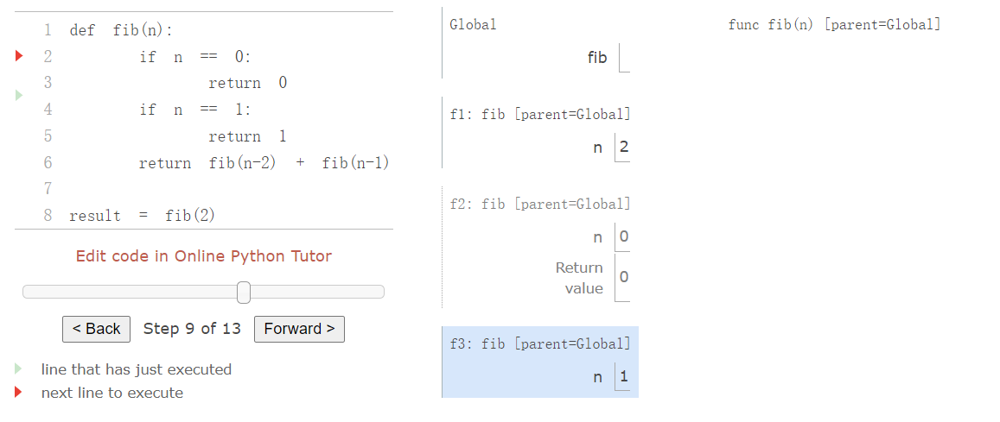

## 2.8 效率

如何表示和处理数据的决策通常受到替代方案效率的影响。 效率是指一个表示或进程使用的计算资源，例如计算 一个函数的结果 或 表示一个对象 需要多少时间和内存。 这些数量可以根据实施的细节而有很大差异。

### 2.8.1 测量效率

准确测量程序需要运行多长时间或消耗多少内存是个挑战性，因为其结果取决于配置计算机的许多细节。 描述程序效率的一种更可靠的方法是测量某个事件发生了多少次，例如函数调用。

让我们回到我们的第一个树递归函数，用于计算斐波那契数列中数字的` fib `函数。

```python
>>> def fib(n):
        if n == 0:
            return 0
        if n == 1:
            return 1
        return fib(n-2) + fib(n-1)
>>> fib(5)
5
```

考虑由计算 `fib(6) `产生的计算模式，如下所示。 为了计算 `fib(5)`，我们计算` fib(3) `和 `fib(4)`。 为了计算` fib(3)`，我们计算 `fib(1) `和` fib(2`)。 这个过程看起来像一棵树。 每个蓝点表示在这棵树的遍历中完成了斐波那契数的计算。


这个函数作为一个典型的树递归很有指导意义，但它是一种计算斐波那契数的非常低效的方法，因为它做了很多冗余计算。 `fib(3) `的整个计算都是重复的。

我们可以衡量这种低效率。 高阶 `count` 函数为其参数返回一个等效函数，该函数也维护一个 `call_count `属性。 通过这种方式，我们可以检查 `fib` 被调用了多少次。

```python
>>> def count(f):
        def counted(*args):
            counted.call_count += 1
            return f(*args)
        counted.call_count = 0
        return counted
```

通过计算对 `fib` 的调用次数，我们看到所需调用的增长速度比斐波那契数本身更快。 这种调用的快速扩展是树递归函数的特征。

```python
>>> fib = count(fib)
>>> fib(19)
4181
>>> fib.call_count
13529
```

**空间**：为了理解一个函数的空间需求，我们必须在我们的计算环境模型中一般性地指定内存是如何使用、保存和回收的。在计算表达式时，解释器保留所有活动环境以及这些环境引用的所有值和帧。如果环境为正在计算的某个表达式提供计算上下文，则它是活动的。每当创建第一帧的函数调用计算完时，环境就会变为非活动状态。

例如，在计算` fib` 时，解释器继续按照前面显示的顺序计算每个值，遍历树的结构。为此，它只需要在计算中的任何点跟踪树中当前节点之上的那些节点。用于计算其余分支的内存可以回收，因为它不会影响未来的计算。一般来说，树递归函数所需的空间将与树的最大深度成正比。

下图描述了计算` fib(3) `时创建的环境。在计算第一次调用 `fib` 返回表达式的过程中，计算表达式 `fib(n-2)`，产生值 0。一旦计算出该值，就不再需要相应的环境框架（灰显） : 它不是活跃环境的一部分。因此，设计良好的解释器可以回收用于存储该帧的内存。另一方面，如果解释器当前正在计算` fib(n-1)`，那么调用` fib` 创建的环境（其中 n 为 2）是活动的。反过来，最初创建用3调用 `fib`创建  的环境是活动的，因为它的返回值尚未计算。



高阶 `count_frames `函数跟踪 `open_count`，即对尚未返回的函数` f` 的调用次数。 `max_count` 属性是 `open_count` 曾经达到的最大值，它对应于在计算过程中同时处于活动状态的最大帧数。

```python
>>> def count_frames(f):
        def counted(*args):
            counted.open_count += 1
            counted.max_count = max(counted.max_count, counted.open_count)
            result = f(*args)
            counted.open_count -= 1
            return result
        counted.open_count = 0
        counted.max_count = 0
        return counted
>>> fib = count_frames(fib)
>>> fib(19)
4181
>>> fib.open_count
0
>>> fib.max_count
19
>>> fib(24)
46368
>>> fib.max_count
24
```

总而言之，以活动帧为单位测量的` fib` 函数的空间需求比输入小一，这往往很小。 以总递归调用衡量的时间要求大于输出，这往往是巨大的。


## 2.8.2 记忆

树递归计算过程通常可以通过记忆来提高效率，记忆是一种强大的技术，可以提高重复计算的递归函数的效率。 记忆函数将存储它之前收到的任何参数的返回值。 对 `fib(25)` 的第二次调用不会以递归方式重新计算返回值，而是返回已经构建的现有值。

记忆可以自然地表达为高阶函数，也可以用作装饰器。 下面的定义创建了先前计算结果的缓存，由被计算出来的参数索引。 字典的使用要求记忆函数的参数是不可变的。

```python
>>> def memo(f):
        cache = {}
        def memoized(n):
            if n not in cache:
                cache[n] = f(n)
            return cache[n]
        return memoized
```

如果我们将`memo `用于斐波那契数的递归计算，则会出现一种新的计算模式，如下所示。


在计算 `fib(5) `时，`fib(2) `和 `fib(3) `的结果在树的右分支上计算 fib(4) 时被重用。 因此，树递归的大部分计算都不需要。

使用 `count`，我们可以看到` fib `函数实际上只为` fib `的每个唯一输入调用一次。

```python
>>> counted_fib = count(fib)
>>> fib  = memo(counted_fib)
>>> fib(19)
4181
>>> counted_fib.call_count
20
>>> fib(34)
5702887
>>> counted_fib.call_count
35
```


### 2.8.3 增长度

正如前面的示例所示，过程在消耗空间和时间计算资源的速率上可能存在很大差异。 但是，准确确定调用函数时将使用多少空间或时间是一项非常困难的任务，这取决于许多因素。 分析进程的一种有用方法是将其与一组具有相似要求的进程分为一类。 一个有用的分类是过程的增长度，它用简单的术语表示过程的资源需求如何作为输入的函数增长。

作为增长度的介绍，我们将在下面分析函数 `count_factors`，它计算将输入 n 整除的整数个数。 该函数尝试将 n 除以每个小于或等于其平方根的整数。 该实现利用了这样一个事实，即如果 k 除以 n 并且**k<√n** ，那么还有另一个因子 **j=n/k** 使得 **j>√n**。


计算` count_factors` 需要多少时间？ 确切的答案在不同的机器上会有所不同，但我们可以对所涉及的计算量做出一些有用的一般性观察。 该进程执行 `while` 语句主体的总次数是小于**√ n**的最大整数。 此 `while` 语句之前和之后的语句只执行一次。 因此，执行的语句总数为**w⋅√n+v**，其中 **w**是 `while` 主体中的语句数，**v** 是 while 语句之外的语句数。 尽管不准确，但该公式通常描述了需要多少时间来计算` count_factors` 作为输入 n 的函数。

很难获得更准确的描述。 常量 **w** 和 **v** 根本不是常量，因为对因子的赋值语句有时会被执行，但有时不会。 增长度分析使我们能够忽略这些细节，专注于增长的一般形式。 特别是，`count_factors` 的增长度精确地表达了计算 `count_factors(n) `所需的时间量以 **√n** 的速率缩放，在某些常数的范围内。

**Theta 表示法**： 令 **n** 为衡量某个过程的输入大小的参数，令 **R(n)** 为过程对大小为 **n** 的输入所需的某种资源量。 在我们之前的示例中，我们将 **n** 视为要计算给定函数的数字，但还有其他可能性。 例如，如果我们的目标是计算一个数字的平方根的近似值，我们可能会将 **n** 视为所需准确度的位数。

`R(n) `可能测量使用的内存量、执行的基本机器步骤数等。 在一次只执行固定数量步骤的计算机中，计算表达式所需的时间将与计算过程中执行的基本步骤的数量成正比。

我们说 **R(n)** 的增长阶数为 **Θ(f(n))**，写成 **R(n)=Θ(f(n))**（读作“**f(n)** 的 theta”），如果存在独立于 n 的正常数 **k1** 和 **k2** 使得
$$
k1⋅f(n)≤R(n)≤k2⋅f(n)
$$
对于任何大于某个最小值 m 的 n 值。 换句话说，对于较大的 n，值 R(n) 总是夹在两个都与 f(n) 缩放的值之间：

- 一个下限**k1⋅f(n)** 和
- 一个上限 **k2⋅f(n)**

我们可以用这个定义来表明，通过检查函数体，计算`count_factors(n)` 所需的步数随着 Θ(√n) 增长。

首先，我们选择 **k1=1** 和 **m=0**，因此对于任何 **n>0**，**count_factors(n)** 的下界状态至少需要 **1⋅√ n** 步。 在 `while` 语句之外至少执行了 4 行，每行至少需要 1 步才能执行。 在 `while `主体中至少执行了两行，以及` while `标头本身。 所有这些都至少需要一个步骤。 while 主体至少被评估 **√(n−1)** 次。 组合这些下界，我们看到该过程至少需要 4+3⋅(√n −1) 步，这总是大于 **k1⋅√n**。

其次，我们可以验证上限。 我们假设 `count_factors` 的主体中的任何单行最多需要 p 步。 这个假设并不适用于 Python 的每一行，但在这种情况下确实成立。 然后，计算 **count_factors(n)** 最多可能需要 **p⋅(5+4√n)**，因为在 while 语句之外有 5 行，在内部有 4 行（包括标题）。 即使每个 if 标头的计算结果为 true，这个上限也成立。 最后，如果我们选择 **k2=5p**，那么所需的步数总是小于 **k2⋅√n**。 我们的参数完整的。


## 2.8.4 示例：求幂

考虑对给定数值求幂的问题。我们希望有一个函数，它接受底数`b`和正整数指数`n`作为参数，并计算出`b^n`。一种方式就是通过递归定义：

```
b^n = b·b^(n-1)
b^0 = 1
```

这可以翻译成递归函数：

```python
>>> def exp(b, n):
        if n == 0:
            return 1
        return b * exp(b, n-1)
```

这是个线性的递归过程，需要`Θ(n)`的步骤和空间。就像阶乘那样，我们可以编写等价的线性迭代形式，它需要相似的步骤数量，但只需要固定的空间。

```python
>>> def exp_iter(b, n):
        result = 1
        for _ in range(n):
            result = result * b
        return result
```

我们可以以更少的步骤求幂，通过逐次平方。例如，我们这样计算`b^8`：

```
b·( b·( b·( b·( b·( b·( b·b ) ) ) ) ) )
```

我们可以使用三次乘法来计算它：

```
b^2 = b·b
b^4 = b^2·b^2
b^8 = b^4·b^4
```

这个方法对于 2 的幂的指数工作良好。我们也可以使用这个递归规则，在求幂中利用连续平方：

[](https://github.com/apachecn/sicp-py-zh/blob/master/img/20160907175856.jpg)

我们也可以将此方法表示为递归函数：

```python
>>> def square(x):
        return x*x
        
>>> def fast_exp(b, n):
        if n == 0:
            return 1
        if n % 2 == 0:
            return square(fast_exp(b, n//2))
        else:
            return b * fast_exp(b, n-1)
>>> fast_exp(2, 100)
1267650600228229401496703205376
```

`fast_exp`所生成的过程的空间和步骤数量随`n`以对数方式增长。要看到这一点，请注意使用`fast_exp`计算`b^2n`比计算`b^n`只需要一步额外的乘法操作。于是，我们能够计算的指数大小，在每次新的乘法操作时都会（近似）加倍。所以，计算`n`的指数所需乘法次数的增长速度大约与 n 以 2 为底的对数一样快。这个过程拥有`Θ(log n)`的增长度。`Θ(log n)`和`Θ(n)`之间的差异在`n`非常大时变得显著。例如，`n`为`1000`时，`fast_exp `仅仅需要`14`次乘法，而不是`1000`。


### 2.8.5 不同的增长度

增长度旨在简化计算过程的分析和比较。 许多不同的过程都可以具有相同的增长顺序，这表明它们以相似的方式扩展。 了解和识别常见的增长度并识别具有相同增长度的过程是计算机科学家的一项基本技能。

**常数**： 常数项不会影响过程的增长度。 因此，例如，Θ(n) 和 Θ(500⋅n) 增长度相同。 该属性遵循 theta 表示法的定义，它允许我们为上限和下限选择任意常数 k1 和 k2（例如 1500）。 为简单起见，常数总是从增长度中省略。

**对数**：对数的底不影响进程的增长度。 例如，**log2n** 和 **log10n** 增长度。 更改对数的底相当于乘以一个常数。

**嵌套**： 当一个内部计算过程对外部过程中的每一步都重复时，那么整个过程的增长度就是外部和内部过程的步骤数的乘积。

例如，下面的函数`overlap`计算同时出现在列表a,b的元素数量。

```python
>>> def overlap(a, b):
        count = 0
        for item in a:
            if item in b:
                count += 1
        return count
>>> overlap([1, 3, 2, 2, 5, 1], [5, 4, 2])
3
```

n 是列表 `b `的长度, **m** 是列表` a` 的长度。 。` for item in b` 循环是内部过程，在这个过程 `in` 运算符需要 **Θ(m)** 时间。` for item in a ` 循环是外部过程 ,在这个过程 `in` 运算符需要 **Θ(n)** 时间。 这个函数的总增长度是 **Θ(m⋅n)**。

**低阶项** ：随着过程输入的增长，计算中增长最快的部分将支配所使用的总资源。 Theta 表示法抓住了这种直觉。 总之，除了增长最快的项之外的所有项都可以在不改变增长度的情况下被删除。

例如，考虑 `one_more` 函数，它返回列表 a 中有多少元素， 该元素比 a 的其他元素大1。 也就是说，在列表 [3, 14, 15, 9] 中，元素 15 比 14 大一，所以` one_more` 将返回 1。

```python
>>> def one_more(a):
        return overlap([x-1 for x in a], a)
>>> one_more([3, 14, 15, 9])
1
```

这个计算有两个部分：列表理解和调用`overlap`。 对于长度为 n 的列表 a，列表理解需要 Θ(n) 步，而调用`overlap`则需要 `Θ(n*n)` 步。 步数之和为 `Θ(n+n*n)`，但这并不是表达增长度的最简单方式。

`Θ(n*n+k⋅n) `和 `Θ(n*n) `对于任何常数 k 都是等价的，因为 `n*n`项最终将支配任何 k 的总数。 边界必须仅在大于某个最小值 m 的 n 时成立，这一事实确立了这种等价性。 为简单起见，低阶项总是从增长度中省略，因此我们永远不会在 theta 表达式中看到总和。

**常见的类别**： 鉴于这些等价性质，出现了一小组常见类别来描述大多数计算过程。 下面列出了最常见的增长度，从最慢到最快，以及随着输入增加而增长的描述。 每个类别的示例如下。

| **类别** | **Theta Notation** | **Growth Description**  | **Example** |
| :------- | :----------------- | :---------------------- | :---------- |
| 常数     | Θ(1)               | 增长与输入无关          | `abs`       |
| 对数     | Θ(log n)           | 乘以输入会增加资源      | `fast_exp`  |
| 线性     | Θ(n)               | 增加输入增加资源        | `exp`       |
| 平方     | Θ(n*n)             | 递增输入会增加 n 个资源 | `one_more`  |
| 指数     | Θ(b^n)             | 增加输入会增加资源      | `fib`       |

存在其他类别，例如` count_factors` 的 Θ(√n) 增长。 但是，这些类别特别常见。

指数增长描述了许多不同的增长度，因为改变底数 b 确实会影响增长度。 例如，我们的树递归斐波那契计算` fib` 的步数在其输入 n 中呈指数增长。 特别是，可以证明第 n 个斐波那契数是最接近的整数
$$
\begin{equation*}
\frac{\phi^{n-2}}{\sqrt{5}}
\end{equation*}
$$
其中 φ 是黄金比例：
$$
\begin{equation*}
\phi = \frac{1 + \sqrt{5}}{2} \approx 1.6180
\end{equation*}
$$
我们还指出，步数与结果值成比例，因此树递归过程需要
$$
\Theta(\phi^n)
$$
步，这是一个随 n 呈指数增长的函数。